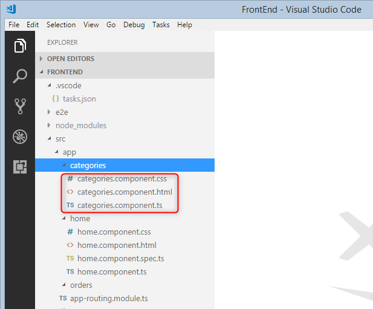

# Create a new component

Using the terminal view, type:

```
npm run gc categories
```

If you want to specify more than one word as a component name, you need to use hyphen between the words and no upper case:

```
npm run gc categories-list
```

It will generate a new folder called "categories" with three files:



1)	categories.components.ts -  The typescript code
2)	categories.components.html - 	The html
3)	categories.component.css -  The css for this specific component


#### Read more about it:
https://angular.io/tutorial/toh-pt1

