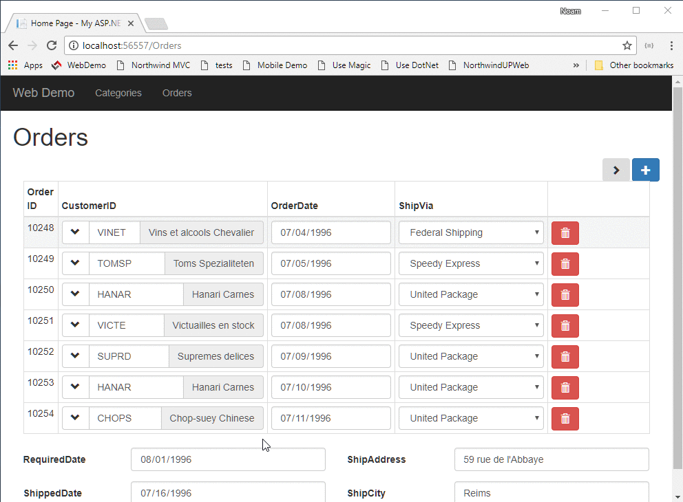

* Add the `<select-popup>` definition to the template
* Add a handler for the `click` of the column - in which we'll call the `showSelectPopup` method, and send it an arrow function so when the user selects, it'll update the `customerID` column in the `order` object based on the `id` of the selected `customer` object.

`src/app/home/home.component.ts`
```csdiff
export class AppComponent {
+ selectCustomerGrid = new radweb.GridSettings(new models.Customers());
  ordersGrid = new radweb.GridSettings(new models.Orders(),
    {
      numOfColumnsInGrid: 4,
      allowUpdate: true,
      columnSettings: orders => [
        {
          column: orders.id,
          readonly: true
        },
        {
          column: orders.customerID,
          getValue: orders =>
            orders.lookup(new models.Customers(), orders.customerID).companyName,
+         click: orders =>
+           this.selectCustomerGrid.showSelectPopup(
+             selectedCustomer =>
+               orders.customerID.value = selectedCustomer.id.value)
        },
        orders.orderDate,
        {
          column: orders.shipVia,
          dropDown: {
            source: new models.Shippers()
          },
          cssClass:'col-sm-3'
        },
        orders.requiredDate,
        orders.shippedDate,
        orders.shipAddress,
        orders.shipCity
      ]
    }
  );
}
```
`src/app/home/home.component.html`
```csdiff
  <h1>Orders</h1>
  <data-grid [settings]="ordersGrid"></data-grid>
+ <select-popup [settings]="selectCustomerGrid"></select-popup>
`
})

```

## Customise the select popup info

```csdiff
export class AppComponent {
  selectCustomerGrid = new radweb.GridSettings(new models.Customers(),
+   {
+     numOfColumnsInGrid:4,
+     columnSettings: customers => [
+       customers.id,
+       customers.companyName,
+       customers.contactName,
+       customers.country,
+       customers.address,
+       customers.city
+     ]
+   });
  ordersGrid = new radweb.GridSettings(new models.Orders(),
    {
      numOfColumnsInGrid: 4,
      allowUpdate: true,

```

## The user experiance
