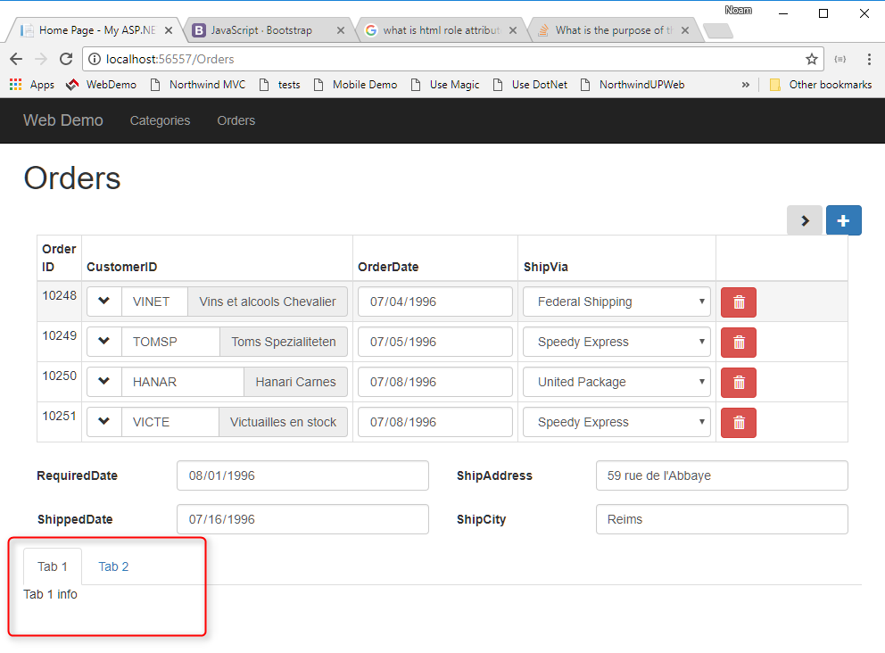

First let's reduce the number of Order rows in the grid:
`src/app/home/home.component.ts`
```csdiff
export class AppComponent {
  selectCustomerGrid = new radweb.GridSettings(new models.Customers(),
    {
      numOfColumnsInGrid: 4,
      columnSettings: customers => [
        customers.id,
        customers.companyName,
        customers.contactName,
        customers.country,
        customers.address,
        customers.city
      ]
    });
  ordersGrid = new radweb.GridSettings(new models.Orders(),
    {
      numOfColumnsInGrid: 4,
+     get: { limit: 4 },
      allowUpdate: true,
...
```

### ngx-bootstrap
We'll use ngx-bootstrap tab controls. See: 
[ngx-bootstrap tabs](https://valor-software.com/ngx-bootstrap/#/tabs)

In the `src/app/home/home.component.html`
```csdiff
 <h1>Orders</h1>
 <data-grid [settings]="ordersGrid"></data-grid>
 <select-popup [settings]="selectCustomerGrid"></select-popup>
+ <tabset>
+   <tab heading='Tab 1'>Tab 1 content</tab>
+   <tab heading='Tab 2'>Tab 2 content</tab>
+ </tabset>
```
