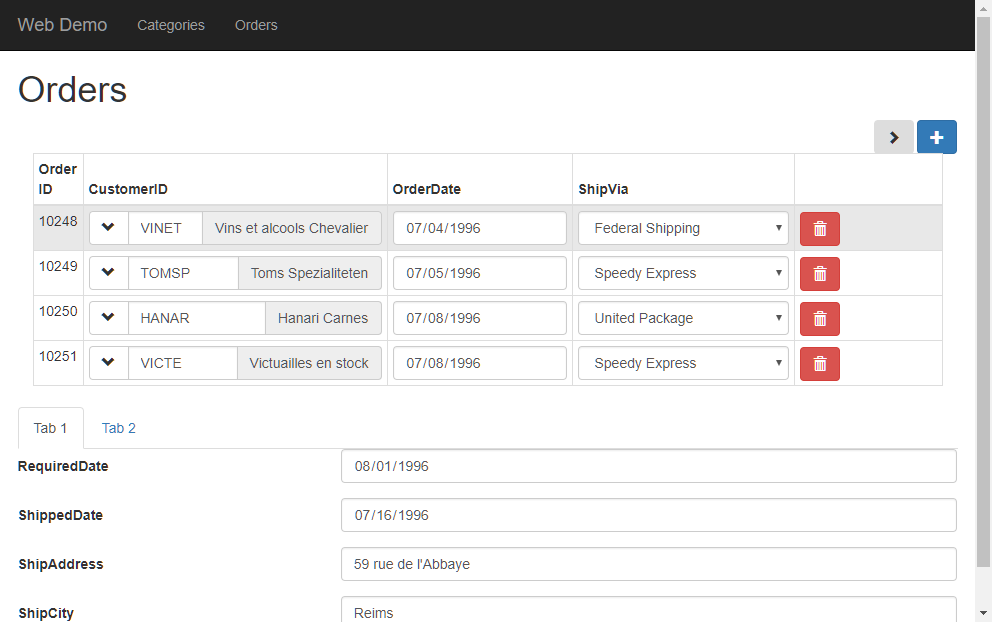
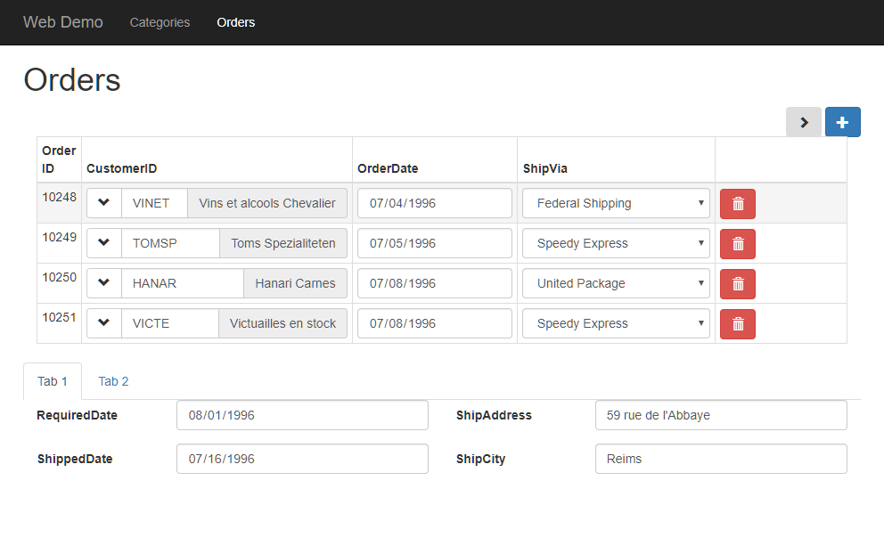

An area is a way to display several controls outside of a grid and group them together in an area.

### Add ship info area into tab 1
* We'll use the add area function to define the area, and move some columns from the order grid to that area

```csdiff
export class AppComponent {
  selectCustomerGrid = new radweb.GridSettings(new models.Customers(),
    {
      numOfColumnsInGrid: 4,
      columnSettings: customers => [
        customers.id,
        customers.companyName,
        customers.contactName,
        customers.country,
        customers.address,
        customers.city
      ]
    });
  ordersGrid = new radweb.GridSettings(new models.Orders(),
    {
      numOfColumnsInGrid: 4,
      get: { limit: 4 },
      allowUpdate: true,
      columnSettings: orders => [
        {
          column: orders.id,
          readonly: true
        },
        {
          column: orders.customerID,
          getValue: orders =>
            orders.lookup(new models.Customers(), orders.customerID).companyName,
          click: orders =>
            this.selectCustomerGrid.showSelectPopup(
              selectedCustomer =>
                orders.customerID.value = selectedCustomer.id.value)
        },
        orders.orderDate,
        {
          column: orders.shipVia,
          dropDown: {
            source: new models.Shippers()
          },
          cssClass: 'col-sm-3'
        },
-       orders.requiredDate,
-       orders.shippedDate,
-       orders.shipAddress,
-       orders.shipCity
      ]
    }
  );
+ shipInfoArea = this.ordersGrid.addArea({
+   columnSettings: orders => [
+     orders.requiredDate,
+     orders.shippedDate,
+     orders.shipAddress,
+     orders.shipCity
+   ]
+ });
}
```
`src/app/app.component.html`
```csdiff
  <h1>Orders</h1>
  <data-grid [settings]="ordersGrid"></data-grid>
  <select-popup [settings]="selectCustomerGrid"></select-popup>
  <tabset>
-   <tab heading='Tab 1'>
-     Tab 1 content
+   <tab heading='Ship Info'>
+     <data-area [settings]="shipInfoArea" ></data-area>
    </tab>
    <tab heading='Tab 2'>Tab 2 content</tab>
  </tabset>
```



By default all the data column are displayed one after the other. We can split them into more columns:
`src/app/app.component.ts`
```csdiff
  shipInfoArea = this.ordersGrid.addArea({
+   numberOfColumnAreas:2,
    columnSettings: orders => [
      orders.requiredDate,
      orders.shippedDate,
      orders.shipAddress,
      orders.shipCity
    ]
  });

```



