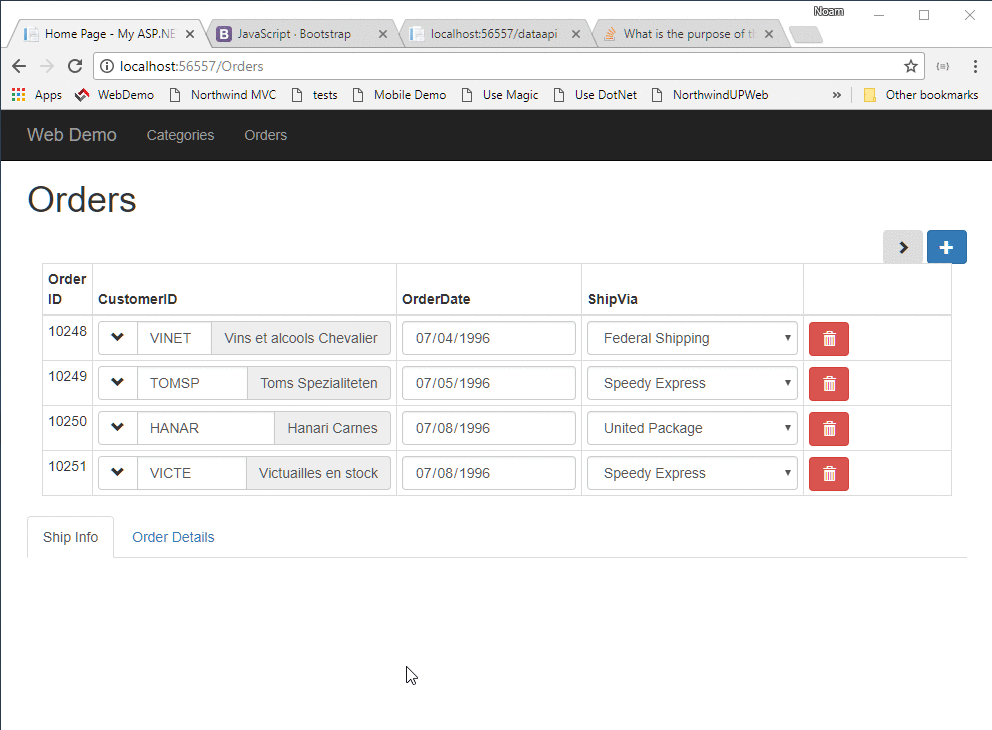

We'll use the `onEnterRow` event, that is set to an Arrow Function that receives an  `order` object of the specfic order. We'll use that order to filter the `orderDetails` `orderID` column.
`src/app/app.component.ts`
```csdiff
export class AppComponent {
  selectCustomerGrid = new radweb.GridSettings(new models.Customers(),
    {
      numOfColumnsInGrid: 4,
      columnSettings: customers => [
        customers.id,
        customers.companyName,
        customers.contactName,
        customers.country,
        customers.address,
        customers.city
      ]
    });
  ordersGrid = new radweb.GridSettings(new models.Orders(),
    {
      numOfColumnsInGrid: 4,
      get: { limit: 4 },
      allowUpdate: true,
+     onEnterRow: orders =>
+       this.orderDetailsGrid.get({
+         where: orderDetails =>
+           orderDetails.orderID.isEqualTo(orders.id)
+       }),
      columnSettings: orders => [
        {
          column: orders.id,
          readonly: true
        },
        {
          column: orders.customerID,
          getValue: orders =>
            orders.lookup(new models.Customers(), orders.customerID).companyName,
          click: orders =>
            this.selectCustomerGrid.showSelectPopup(
              selectedCustomer =>
                orders.customerID.value = selectedCustomer.id.value)
        },
        orders.orderDate,
        {
          column: orders.shipVia,
          dropDown: {
            source: new models.Shippers()
          },
          cssClass: 'col-sm-3'
        }
      ]
    }
  );
  shipInfoArea = this.ordersGrid.addArea({
    numberOfColumnAreas:2,
    columnSettings: orders => [
      orders.requiredDate,
      orders.shippedDate,
      orders.shipAddress,
      orders.shipCity
    ]
  });
  orderDetailsGrid = new radweb.GridSettings(new models.Order_details());
}
```


