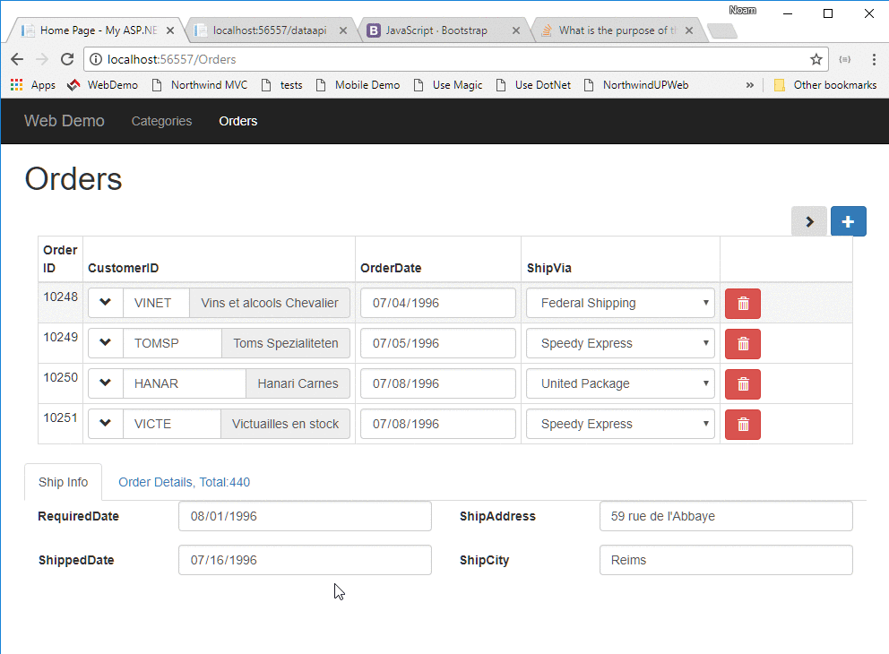

We want to reuse the migrated report called PrintOrder from the Northwind.Order project.
* First we'll add a reference to the `Northwind.Order.dll` that is in the `bin` directory
* We'll add a call to it in the `Controllers\HomeController.cs`

```csdiff
public ActionResult Index()
{
    return View();
}

+[ENV.Web.PrintToPDF]
+public void Print(int id)
+{
+    new Northwind.Orders.Print_Order().Run(id);
+}

public ActionResult About()
{
    ViewBag.Message = "Your application description page.";

    return View();
}
```
* We've added the `Print` method, that receives an `id` and in that method we called the migrated `Print_Order` code, and sent it the `id`
* We've used the `[ENV.Web.PrintToPDF]` attribute, which will hijack any printing that happens within the `Print` method, and create a pdf file and return it to the browser when we're done.
### The structure of the url
The url structure that will be used here is as follow: `{controller}/{method}/{id}?param1={param1}&param2={param2}`
In our case that will be `Home/Print/10249`, where Home is the controller, Print is the method and id is 10249.
If the method would have received more parameters, it would use their name and values after the `?` sign in the url.

We can use this method to expose any business process as an easy api that can be used from the browser

Here's the result:




<iframe width="560" height="315" src="https://www.youtube.com/embed/KMiPQ4zSBdM" frameborder="0" allowfullscreen></iframe>