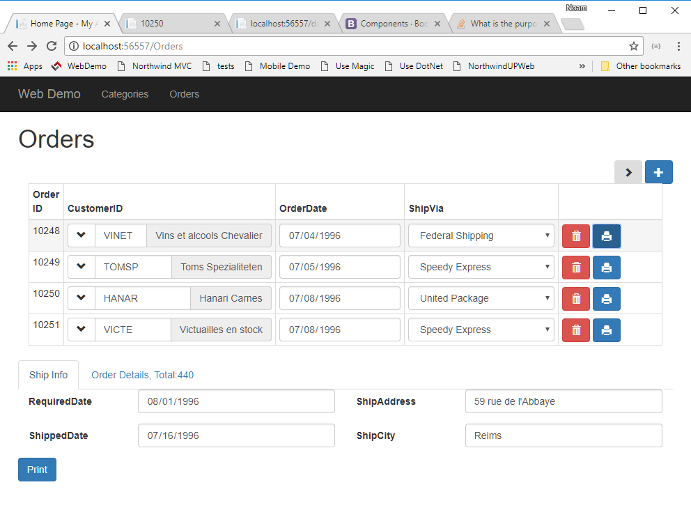

`src/app/home/home.component.ts`
```csdiff
  ordersGrid = new radweb.GridSettings(new models.Orders(),
    {
      numOfColumnsInGrid: 4,
      get: { limit: 4 },
      allowUpdate: true,
      onEnterRow: orders =>
        this.orderDetailsGrid.get({
          where: orderDetails =>
            orderDetails.orderID.isEqualTo(orders.id)
        }),
+     rowButtons: [
+       {
+         click: orders =>
+           window.open(
+             environment.serverUrl + 'home/print/' + orders.id.value),
+         cssClass: 'btn btn-primary glyphicon glyphicon-print'
+       }
+     ],
      columnSettings: orders => [
        {
          column: orders.id,
          readonly: true
        },
        {
          column: orders.customerID,
          getValue: orders =>
```
* We've added the `rowButtons` array to the settings of the `orders` object
* We've added a button, and handled the `click` event - that received an `order` object, and printed based on that `order` `id`
* We've used bootstrap's `btn btn-primary glyphicon glyphicon-print` css classes to style the button and display it's printer icon, based on the icons that come with bootstrap, as explained in https://getbootstrap.com/docs/3.3/components/

