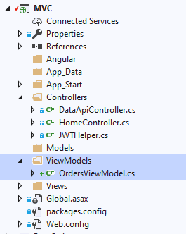

We want to have more control over the `Orders` rest API:
1. We want to make the Order ID automatically set for new rows.
2. We want to validate that the customer id exists.
3. We want to validate that the shipper id exists.

To do that we'll create a View Model and manipulate it.
### Adding a view model
We'll add a folder called `ViewModels` under the `MVC` root folder and in it we'll add a new item using the `ViewModel` template and call it `OrdersViewModel`


```csdiff
using System;
using System.Collections.Generic;
using System.Text;
using Firefly.Box;
using ENV;
using ENV.Web;

namespace MVC.ViewModels
{
    class OrdersViewModel : ViewModel
    {
        public OrdersViewModel()
        {
        }
    }
}

```

### Register the `OrdersViewModel` instead of the `Orders` entity in the `Controllers\DataApiController.cs`
```csdiff
static DataApiController()
{
    _dataApi.Register(typeof(Northwind.Models.Categories),true);
-   _dataApi.Register(typeof(Northwind.Models.Orders),true);
+   _dataApi.Register(typeof(ViewModels.OrdersViewModel));
    _dataApi.Register("orderDetails",typeof(Northwind.Models.Order_Details),true);
    _dataApi.Register(typeof(Northwind.Models.Customers));

```

### Set the `Orders` as the `From` of the `ViewModel`
```csdiff
class OrdersViewModel : ViewModel
{
+   Northwind.Models.Orders Orders = new Northwind.Models.Orders();
    public OrdersViewModel()
    {
+       From = Orders;
    }
}
```

### Make the `ViewModel` updatable
```csdiff
class OrdersViewModel : ViewModel
{
    Northwind.Models.Orders Orders = new Northwind.Models.Orders();
    public OrdersViewModel()
    {
        From = Orders;
+       AllowUpdate = true;
+       AllowInsert = true;
+       AllowDelete = true;
    }
}

```

