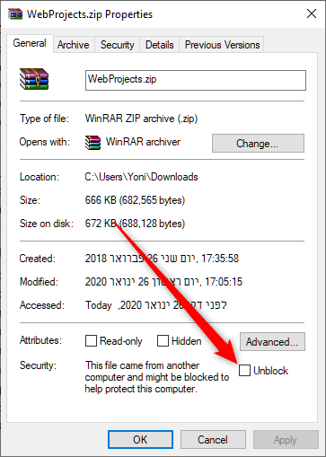
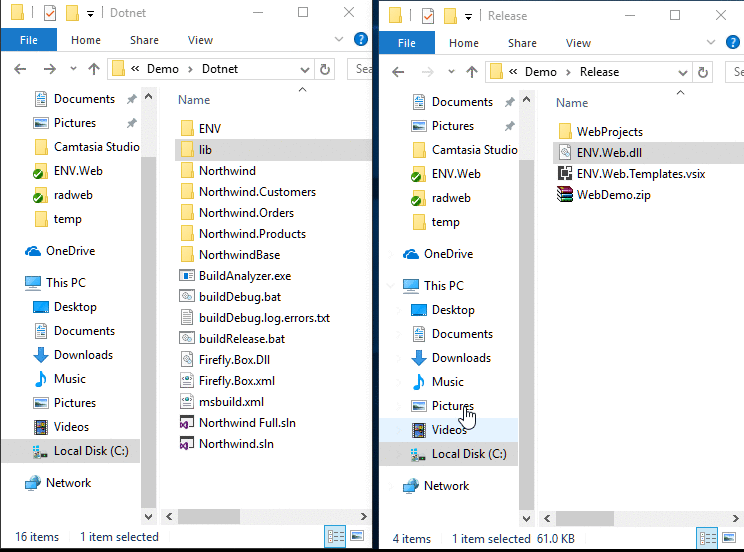

Download the files from: https://github.com/FireflyMigration/ENV.Web/releases/tag/1.0.0.14

**make sure to unblock files**
In the file properties of the `ENV.Web.dll` and the `WebProjects.zip` files, check the "Unblock" checkbox if you have it.

1. Place the `ENV.Web.dll` in the `lib` directory of your `Northwind Training` folder.
2. Open the WebProjects.zip and move the two folders in it to your `Northwind Training` folder.

