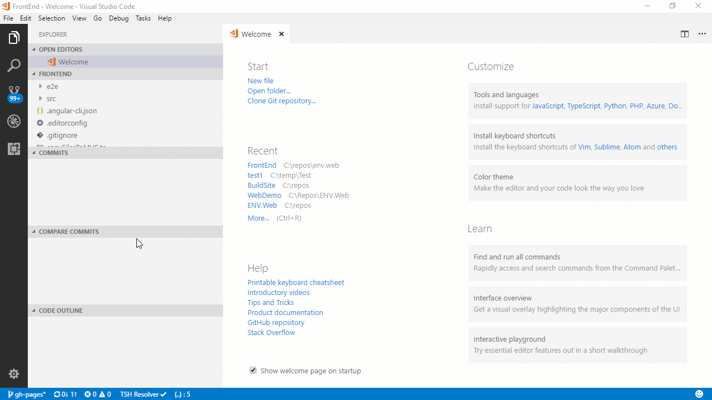
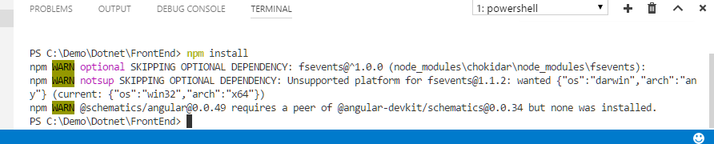

In VS Code, open  the`terminal` window by going to: `View \ Integrated Terminal` or clicking <kbd>ctrl</kbd> + <kbd>`</kbd>

In the command line run:
```
npm install
```

npm will now download and install all the packages listed in the dependencies in package.json, it'll take a few minutes.



When it's done you'll see the result like this:




## What is npm?
npm (Node Package Manager) is a command line utility based on node.js that helps manage javascript projects and libraries.

Samples:
```
Npm install – downloads all the packages listed in the dependencies in package.json
Npm install xxxx –save – installs the package xxx to the current project folder and updates the dependencies in package.json
Npm install xxx –savedev - installs the package xxx to the current project folder  and updates the dev-dependencies in package.json
Npm install xxx –g – installs the package to the entire machine – and now you can use it in the command line. For example to install ng (angular cli)  we used the –g flag.
Npm install xxxx@v.v.v installs the xxx package with the specific version.
```

