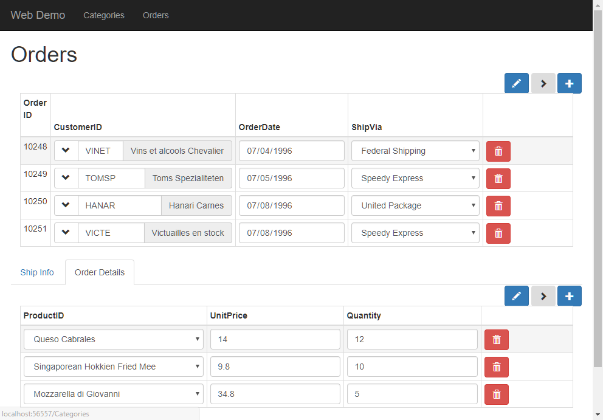

* Select only the columns we want
* Set the caption, and drop down for product id
* set the input type for unitPrice and quantity

`src/app/app.component.ts`
```csdiff
  orderDetailsGrid = new radweb.GridSettings(new models.Order_details(),
    {
      allowUpdate: true,
      allowDelete: true,
      allowInsert: true,
      onNewRow: orderDetail => {
        orderDetail.orderID.value = this.ordersGrid.currentRow.id.value;
        orderDetail.quantity.value = 1;
      },
+     columnSettings: order_details => [
+       {
+         column: order_details.productID,
+         dropDown: {
+           source: new models.Products()
+         }
+       },
+       order_details.unitPrice,
+       order_details.quantity
+     ]
    });
```



