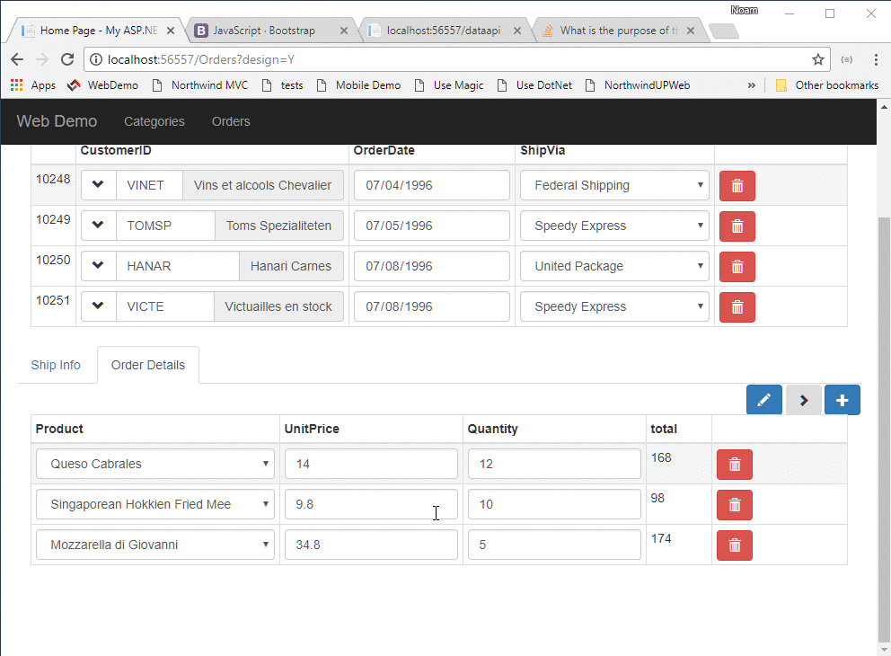

`src/app/app.component.ts`
```csdiff
  orderDetailsGrid = new radweb.GridSettings(new models.Order_details(),
    {
      allowUpdate: true,
      allowDelete: true,
      allowInsert: true,
      onNewRow: orderDetail => {
        orderDetail.orderID.value = this.ordersGrid.currentRow.id.value;
        orderDetail.quantity.value = 1;
      },
      columnSettings: order_details => [
        {
          column: order_details.productID,
          dropDown: {
            source: new models.Products()
          }
        },
        order_details.unitPrice,
        order_details.quantity,
+       {
+         caption: 'Total',
+         getValue: orderDetails =>
+           orderDetails.quantity.value * orderDetails.unitPrice.value
+       }
      ]
    })
```

