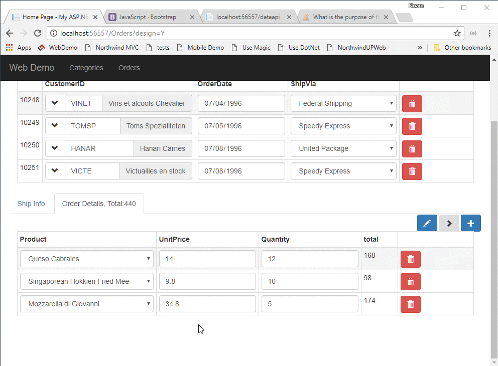

`src/app/home/home.component.ts`
```csdiff
  orderDetailsGrid = new radweb.GridSettings(new models.Order_details(),
    {
      allowUpdate: true,
      allowDelete: true,
      allowInsert: true,
      onNewRow: orderDetail => {
        orderDetail.orderID.value = this.ordersGrid.currentRow.id.value;
        orderDetail.quantity.value = 1;
      },
      columnSettings: order_details => [
        {
          column: order_details.productID,
          dropDown: {
            source: new models.Products()
          }
        },
        order_details.unitPrice,
        order_details.quantity,
        {
          caption: 'Total',
          getValue: orderDetails =>
            orderDetails.quantity.value * orderDetails.unitPrice.value
        }
      ]
    });
+ getOrderTotal() {
+   let result = 0;
+   this.orderDetailsGrid.items.forEach(
+     orderDetail =>
+       result += orderDetail.quantity.value * orderDetail.unitPrice.value);
+   return result.toFixed(2);
+ }
}
```

`src/app/home/home.component.html`
```csdiff
 <h1>Orders</h1>
 <data-grid [settings]="ordersGrid"></data-grid>
 <select-popup [settings]="selectCustomerGrid"></select-popup>
 <tabset>
   <tab heading='Ship Info'>
     <data-area [settings]="shipInfoArea"></data-area>
   </tab>
-  <tab heading='Order Details'>
+  <tab heading='Order Details {{getOrderTotal()}}'>
     <data-grid [settings]="orderDetailsGrid"></data-grid>
   </tab>
 </tabset>
```
