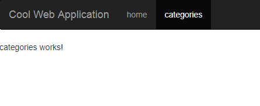

# Routing

The Angular Router enables navigation from one view to the next as users perform application tasks.

Read more about it:  
  	https://angular.io/tutorial/toh-pt5  
	https://angular.io/guide/router


- Open `src/app/app-routing.module.ts`
- Add a new Route path


```csdiff
import { NgModule } from '@angular/core';
import { CommonModule } from '@angular/common';
import { RouterModule, Routes } from '@angular/router';
import { HomeComponent } from './home/home.component';
+import { CategoriesComponent } from './categories/categories.component';


const routes: Routes = [
  { path: 'home', component: HomeComponent },
+ {path:'categories',component:CategoriesComponent},
  { path: '', redirectTo: '/home', pathMatch: 'full' }
];

@NgModule({
  imports: [
    CommonModule, RouterModule.forRoot(routes)
  ],
  declarations: [],
  exports: [RouterModule]
})
export class AppRoutingModule { }
```


Now if we write: `localhost:4200/cateogires` - we will see:



### The Side bar

In the code of `app.component.html` we iterate the available paths and display it in the top – this is very good for simple projects but you’ll probably improve it in real life.


```csdiff
  <div class="container-fluid">
    <div class="navbar-header">
      <button type="button" class="navbar-toggle collapsed" (click)="isCollapsed = !isCollapsed" aria-expanded="false">
        <span class="sr-only">Toggle navigation</span>
        <span class="icon-bar"></span>
        <span class="icon-bar"></span>
        <span class="icon-bar"></span>
      </button>
      <a class="navbar-brand" routerLink="/">Cool Web Application</a>
    </div>

    <!-- Display all links based on the registered routes -->
    <div class="collapse navbar-collapse" [collapse]=isCollapsed>
      <ul class="nav navbar-nav">
+       <ng-container *ngFor="let m of router.config">
          <li routerLinkActive="active" *ngIf="m.path && m.path.indexOf(':')<0">
            <a routerLink="{{m.path}}">{{m.path}}
              <span class="sr-only">(current)</span>
            </a>
          </li>
        </ng-container>
      </ul>
    </div>
  </div>
```