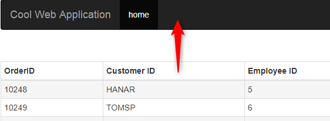

# Add Categories menu

In order to add a new menu entry at the top we will do the following

1) Create a new categories component. (we have been using the Home component so far)
2) Modify the categories component
3) Route the new menu to the categories component

