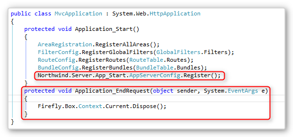
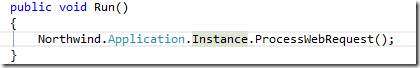
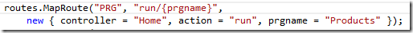
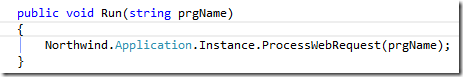
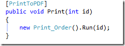
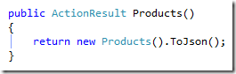

1. Create a new MVC project.
2. Add all the references used by the xx.Server project to the new MVC project.  
Specifically all the projects of your application, and:
    * ENV
    * Firefly.Box
    * System.Windows.Forms
3. Copy the ini file.
4. Copy the “App_Start” folder content to the “App_Start” of the new MVC project.
5. Copy the following lines from the original global.asax to the global.asax of the new MVC project. 

6. Change the project to use Local IIS – and click “Create Virtual Directory”  
Project Properties\Web\Servers\LocalIIS
7. Copy the Request.aspx files.  Or Add a void Method to a controller and call Application.Instance.ProcessWebRequest

8.You can also go one step further and add support for cool routing:

For extra features add:

1. Reference to ENV.Web.MVC dll
2. To print pdf:

3. To Create Json:

