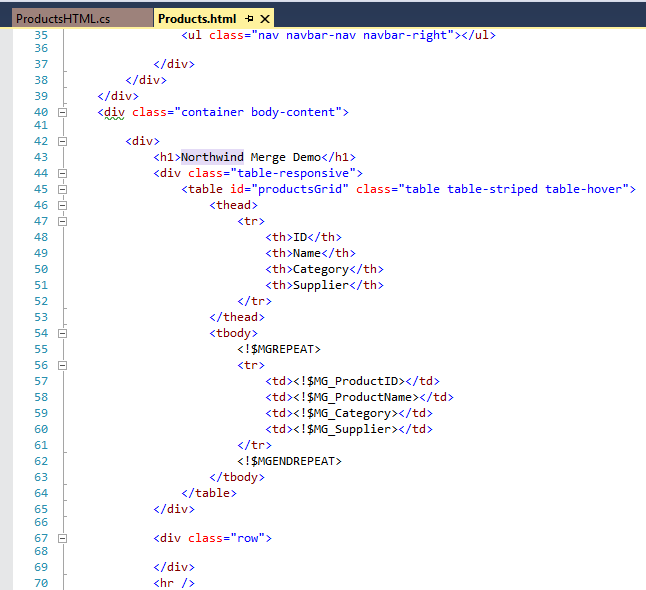
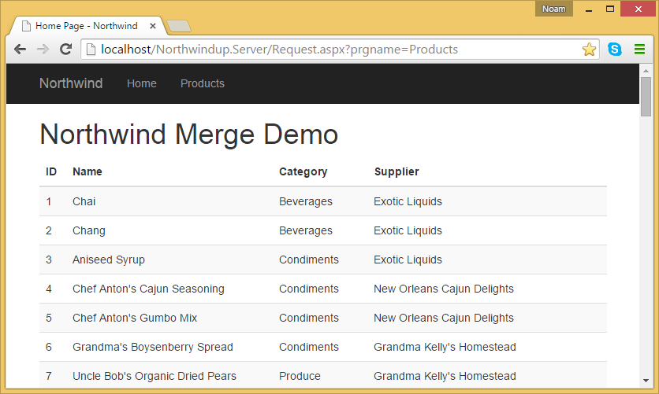
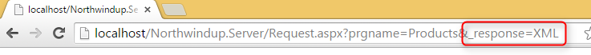
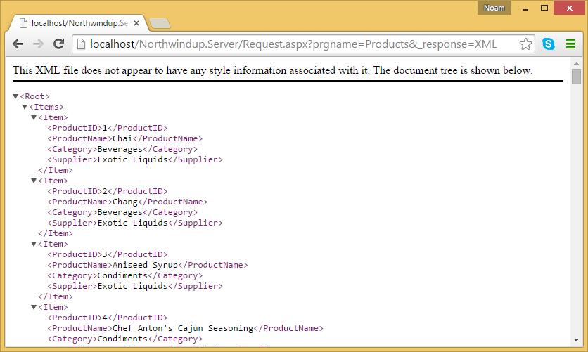
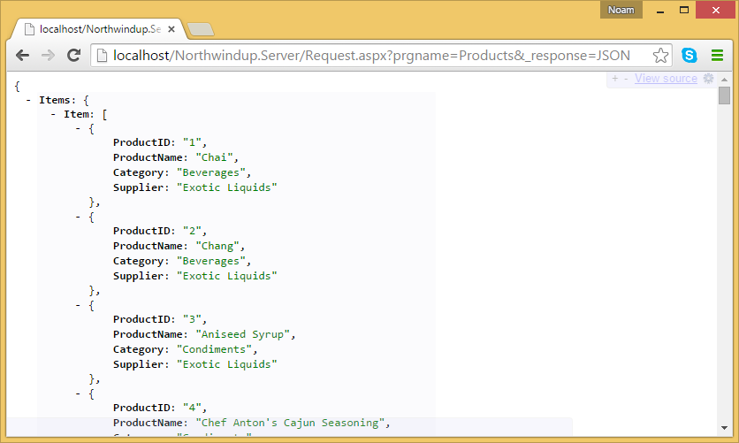

This article explains how to take a migrated "Web Merge" application and turn the "Merge" result into a JSON response

<iframe width="560" height="315" src="https://www.youtube.com/embed/XM2VDwexlOU" frameborder="0" allowfullscreen></iframe>

Several month ago a customer approached me with an interesting issue.
They have a large web application that we have migrated from magic to .NET. It was based on text templates (merge as they were called in magic) to return html files with merged data into them.

The issue was that they would like to create a mobile app – but they do not want to touch the server side code at all (there is a lot of code). All they wanted was that the application which today returns merged html files – would just return the data in them.

So we have developed the technology to do that. Here goes.

Here is the text template:

And the result looks like this:

Now to get the result as Json – without changing any of the server code – all I have to do is add the following parameter to the url (the parameter name is configurable of course):

And here is the result I get:

If I change the parameter to JSON – I get the following result:

This allows me to develop a new mobile app, or a new website front end based on Angular/Knockout or what ever – without requiring any change to the server side code.

We provide this as an optional add on, if you are interested in buying – contact us to make it happen