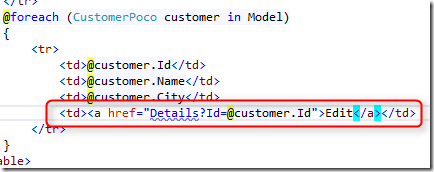
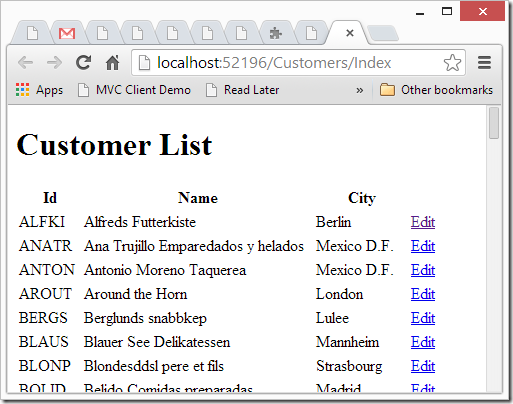

# Now for the View

As this article targets developers with little to no MVC background, I’ll use basic HTML. Know that MVC has a lot of helpers that help you write this HTML better, faster and shorter.

As before, I’ll right click on  “View” and select Add View.

Here is the empty View:  

Note the first line:  
  
This line indicates for the view, that it is based on the “CustomerPoco” object we created earlier, causing it to give us intelisense, and make our lives easier.

Here is the HTML I wrote to display the form that’ll be used to edit the customer:  
  
Note that for the Name input I used plain HTML – but for the City, I used the MVC “HTML” helper that’ll generate that HTML for us. When using MVC you can use the built in helpers or create your own to handle the HTML generation.

Here is the result we get when we run this in the browser:  
   
Next, let’s write the code which performs the actual update to the database.
We’ll be using the migrated entities and a business process to perform the update, just like before:  
  
I have highlighted three points:

1. Notice how the parameter is of type CustomerPoco, MVC will help us, and automatically create it with the values that were entered by the user in the form, as long as the names of the “Input” elements match those of the members in the CustomersPoco class.  
This is how it looks in debug when a form is submitted:  
  
2. This is where we update the customers Entity with the values sent from the form.
2. This line of code redirects the user to the index page, sending him back to the Customers List.

That’s it, we’ve done all the heavy lifting and we got an updatable list.

All we need now is a link on the List page that’ll take us to the update screen.

We’ll go to the “Index.cshtml” page and add the following code:  

Now when we run this, we’ll get:
  

And when we click Edit, it’ll take us to the Customer Details page where we can update our customers.  

