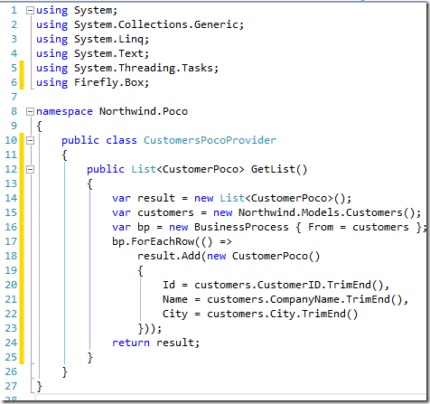

# Creating the Customer Provider Class

So far we moved the CustomerPoco to the shared project, so we can use it in all of our projects, but there is still work to be done.  
In the original code we create a list of customers in the Index Method and in the Json method.

It’s the same code – but it exists twice – let’s remove it.  
To do that, we’ll create a class called “CustomersPocoProvider” in the Northwind.Poco project, and move the List generation code to it.  
  
Now we can change our original CustomersController to use this code, so the two big methods we had before can turn to this:  
  

This is much better.
In the same spirit, let’s move the Update code as well:  
  
So now our CustomersPocoProvider class has a GetList, and Update method.
In a similar way we can move more logic to it, and reuse them all across the application.