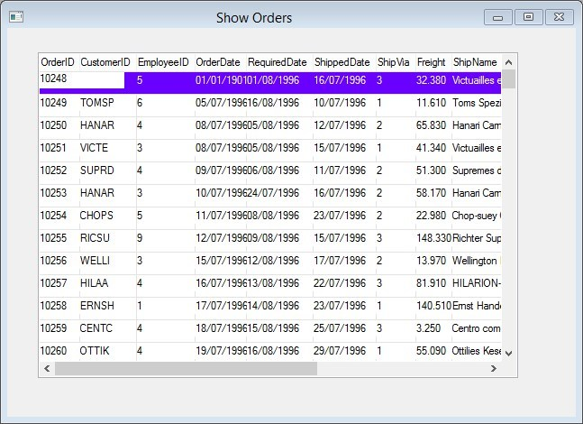

keywords: designer, form, view, dynamic, screen

# Using the same view in another controller

Lets create a new controler for ```ShowOrders``` but use the view we already have:
```
public class ShowOrders : UIControllerBase
{
    public Models.Orders Orders = new Models.Orders();
    public ShowOrders()
    {
        From = Orders;
    }

    public void Run()
    {
        Execute();
    }

    protected override void OnLoad()
    {
        View = () =>
        {
            var view = new Views.ShowView(){ Text = "Show Orders" };
            foreach (var col in Orders.Columns)
            {
                view.AddColumns(col);
            }
            return view;
        };
    }
}

```


The result looks like this:  


> Here I used the ```foreach``` loop to add all the columns just cause I am lazy ;-)

What about adding a control that does something ?  
The next article will show it.