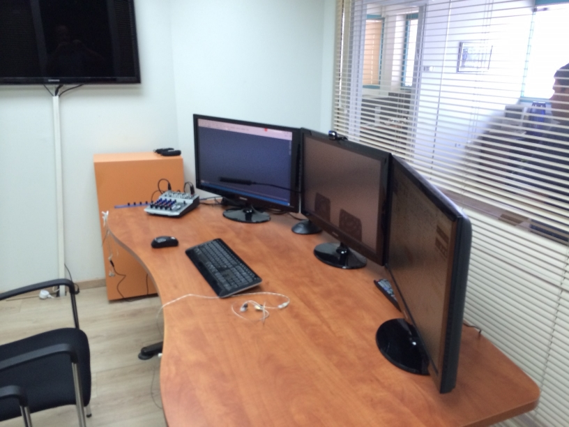
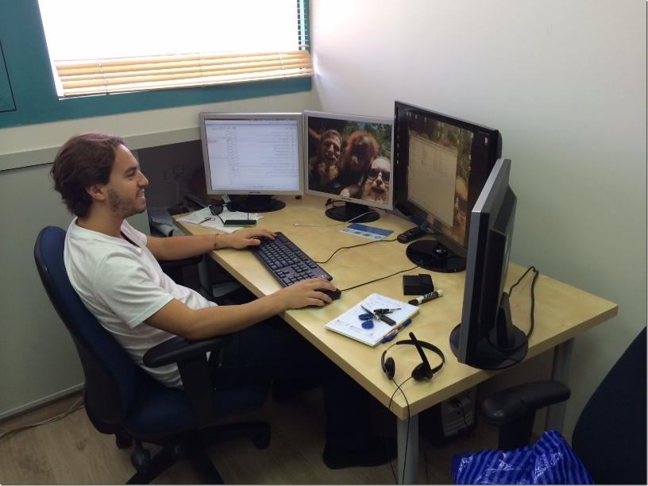
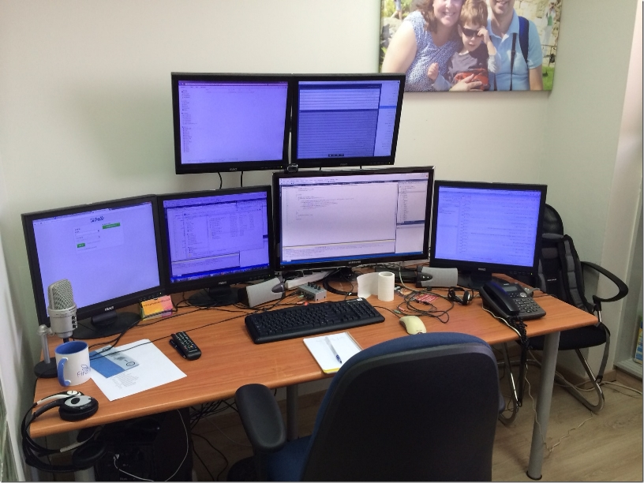
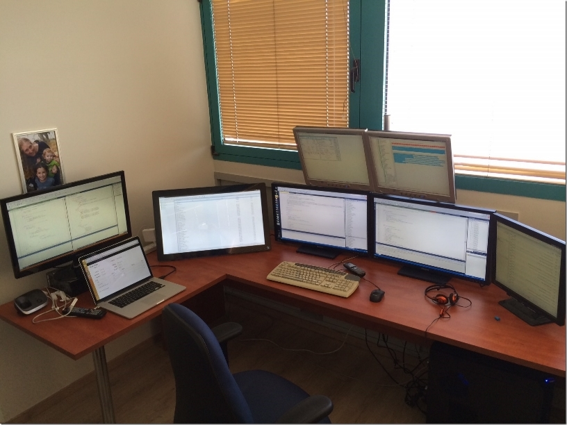

Anybody who knows me, knows that I’m a big believer in multiple screens. I started with two back in 2000,  
and have been stretching the boundaries ever since.  
I now own my own company, and it’s interesting to see how my team have not only adopted the habit, but  
are outperforming me with their screen count.  

People who have visited our office can’t help but ask what they’re good for, and how we use all those screens  
(yes, many screens, one desk), this post was written to answer those questions.

### Online Meeting Room

At Firefly Migrations we have many online meetings – so the room, or rather the screens are our windows to the  
world. We have recently upgraded our Online Meeting Room, and although there is still work to be done, here’s  
what it looks like:  

There are three 29 Inch Samsung screens, configured as follows:

1. The left screen is shared between all meeting participants – we use it to show them their application in .NET  
2. The middle screen shows the camera feed – so we can see who we are talking to. (I believe that seeing the  
person you’re communicating with helps to bridge the cyber gap).  
3. The right screen is used for note taking and additional information we may need during the meeting.

### Ron’s Desk

Ron is in charge of reproducing customer reports, and providing customers with online training. He has three 19 inch  
screens, used to run the original application, the migrated application and a screen to compare the two. He also has  
a 27 Inch wide screen, which he uses for online meetings.

### Sefi’s Desk

Sefi manages the migration projects, designs customer training and oversees them. He claims he needs more screens in  
order to stay on top of more things – we’ve accepted his claim 🙂.

Sefi has configured his screens like so:  
He uses two screens for .NET code, two screens for the tasks he’s working on, another for the file explorer, and one  
for the browser – that makes six.

### My Desk (Noam)

Here’s what you’ll find on my desk:  

* On the left is my MacBook Pro, with an additional 29 inch attached.  
* My main machine has 6 screens, at the moment (64 bit, 32GB ram, i7):  
    * On the right I have my task list.  
    * The two big ones in the middle have .NET code on them, one for the migration engine and another for a  
    customer’s code.  
    * On the left is the customer’s magic code.  
    * Top left shows the running application.  
    * Top right shows the tests that have just run. (you will notice one has failed (in Red).  
