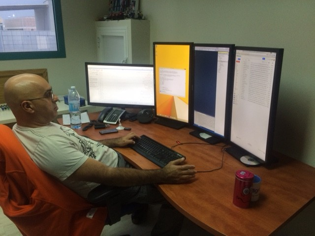
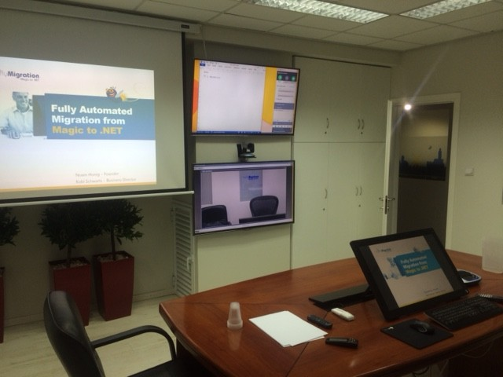
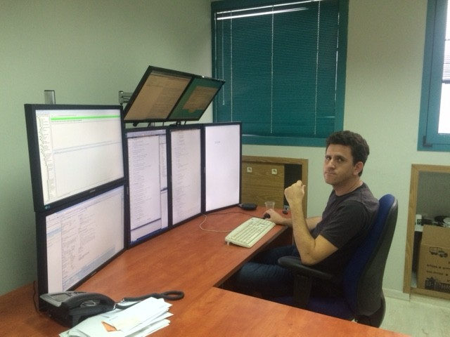
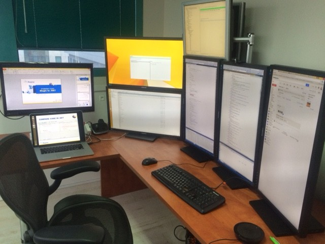

Some of you may remember my article about how much we love screens, posted almost two years ago  
(http://doc.fireflymigration.com/we-love-screens.html).

Well in the last few years we have obviously upgraded everything – and I thought I should share it with you.

First – each member of our technical team has the following workstation:

In the image you can see our head of the Customer Success team, Mr Eran Hazum who as you can see uses 3 Vertical 29 inch screens for code and tasks and another horizontal one – for online meetings with sane people who don’t work vertically.

Our conference room was also upgraded as following:

We are using a 29 inch touch screen that is mirrored by a projector (as you can see on the right) as the main screen for our presentations. We are also using to 50 inch screens in front, one to show the Video of the person we are meeting with, and another for notes (on top).

As a side note – we are using a great piece of hardware for the audio conference.  It’s called Logitech ConferenceCam CC3000e, and it provides great audio including great echo canceling capabilities, and a remote control X10 zoom camera that can make anyone look good.

Next there’s Yoni’s post (our CTO)

And last but not least my post

I’ve called this post we love screens 2015, because soon I hope to report that I replaced it with a 55 inch 4k monitor – as soon as I can find one that we’ll make my eyes happy 🙂