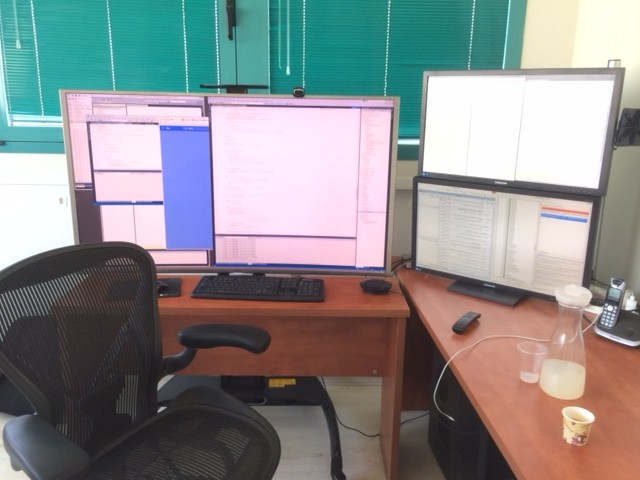

Well, you may remember our previous posts about how much we love to use a lot of screens. (like [this one](we-love-screens.html) from 2013 and [this one](we-love-screens-2015.html) from recently). 

Now we have decided to take it up a notch and go for 4k.

By using a 4k tv I get huge screen real estate, which means I can place lots of windows side by side and re-size them to fit exactly where I want them. It’s also great for showing stuff to colleagues, kind of like a classroom whiteboard you can write everything on without running out of space. 

I know it sounds extreme but if we think back to when people didn’t use computers – do you remember any one working on a 27 inch desk? 

My family comes from the traditional printing business, and their work desks were “light tables” – large tables with back lighting on which you could adjust things before you printed them. And the bigger the tables my parents used, 
the more productive they were. Why should we use any less for our computers? 

Using many screens has an advantage of having a bigger desktop and so you can see many things at the same time. But, when you use it a lot – the screen frames (borders) become an annoyance. 

You can try to use the screen vertically to see more code – but then when you need to see something wide, and you re-size something across more then one screen – the gap between the screens is a pain. 

Many people told me to get a 4K screen. BUT, all the 4k computer monitors were small (up to 40 inch) and I need every pixel. So in order to replace my 27 HD screens with a 4K, without changing the pixel size, I needed a 54-inch. And since there is no 54 I had to settle for 55. 

We’ve done a lot of research and at this time there is no computer screen this big. So we had to turn to tv’s. We were very worried about using a TV as a day to day computer monitor – so we have done all the research and found the correct specs, and after installing it and configuring it – it’s amazing. 

Here are the things you should consider when trying this out.

1. HDMI 2+ – it is critical to use HDMI 2+ – because if you use an older version of HDMI you’ll only get a refresh rate of 30 hertz – and that’s not enough for a developer. Display port cable is better but at this time there is no TV which supports it. 
2. Use at least 60 hertz – really – 30 hertz is not enough – when I initially mis-configured the screen and only had 30 hertz there was a split second delay for everything – so It was very hard to use the mouse. 
3. Make sure that the tv supports 4:4:4. That means that every pixel has it’s own color definition – it is critical. When I’ve started with the setup and this was configured wrong I would get red and blue text instead of black in certain places on the screen. You can read more that in this article: http://blogs.adobe.com/VideoRoad/2010/06/color_subsampling_or_what_is_4.html 
4. Make sure you configure everything to get these settings right – it took me almost a week to find all the different configurations and how to tune them – if you feel it’s not good enough and your hardware has all the specs – it’s just a matter of more configuration. 

I used the following website to compare different TV’s until I found the one I wanted:
http://www.rtings.com/tv/reviews/by-usage/pc-monitor/best

Here is the configuration I’ve ended up with – and I’m happy with it:

1. Samsung curved 4k 55 inch tv – UN55JS9000FXZA: http://www.samsung.com/us/video/tvs/UN55JS9000FXZA 
2. Display card – GV-N960G1 GAMING-2GD. The goal was to find a resenbly priced 4K, HDMI 2.0 display adapter. 
http://www.gigabyte.com/products/product-page.aspx?pid=5372#ov

**A note about curved TV** – I chose to go with the Samsung curved tv – as I thought it would make my development experience better. Now that I use it I think it’s not that important and not worth the extra cost. There is also another downside which is – you can’t make a curved TV touch enabled (at least not at a reasonable price at this time) so on my next one I’ll probably skip that feature.