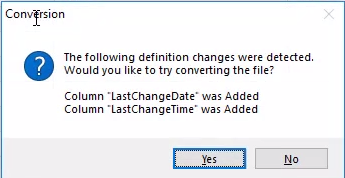
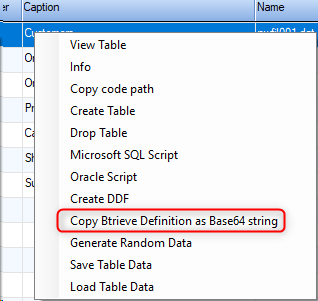

keywords:pervasive, actian
<iframe width="560" height="315" src="https://www.youtube.com/embed/qiVTaKkIBdE" frameborder="0" allowfullscreen></iframe>


## Automatic Btrieve Table Conversion while Developing

To Enable it, call the following method
```csdiff
ENV.Utilities.TableDefinitionConverter.EnableBtrieveAutoConversion();
```


1. Make sure to open the Entity List (Shift F2) and view the table data before the change.
2. Make the change to the Entity class as you want.
3. Build and run the code.
4. Next time that you'll open the table in the Entity List you'll get a message asking if you want to convert the actual data.



5. The conversion will create a backup of the original file with the date and time of the conversion in it's name. for example `nwfil001.dat_mch_2018-09-13_05-48-00`.
6. Once the conversion is done, it'll offer you to copy the code that did the conversion, whuch you can use in your code to run the conversion automatically.

## Converting Btrieve Tables from the code
Item 6 in the previous header will provide you with the code to run the conversion automatically.
Here's the code from the video:
```csdiff
// Copy this code to a database migration program
var oldDef = "AAEAAAD/////AQAAAAAAAAAMAgAAAD9FTlYsIFZlcnNpb249My40LjI0LjMwNzQwLCBDdWx0dXJlPW5ldXRyYWwsIFB1YmxpY0tleVRva2VuPW51bGwFAQAAAB1FTlYuVXRpbGl0aWVzLlRhYmxlRGVmaW5pdGlvbggAAAAIVHlwZU5hbWUHU3FsTmFtZQdDYXB0aW9uCVNxbFNjaGVtYQtCdHJpZXZlTmFtZQVPd25lcgdDb2x1bW5zB0luZGV4ZXMBAQEBAQEEBCBFTlYuVXRpbGl0aWVzLkNvbHVtbkRlZmluaXRpb25bXQIAAAAfRU5WLlV0aWxpdGllcy5JbmRleERlZmluaXRpb25bXQIAAAACAAAABgMAAAAaTm9ydGh3aW5kLk1vZGVscy5DdXN0b21lcnMGBAAAAAlDdXN0b21lcnMJBAAAAAYFAAAAI0M6XEZpcmVmbHlNaWdyYXRpb25cTm9ydGh3aW5kXERhdGFcBgYAAAAMbndmaWwwMDEuZGF0CgkHAAAACQgAAAAHBwAAAAABAAAACwAAAAQeRU5WLlV0aWxpdGllcy5Db2x1bW5EZWZpbml0aW9uAgAAAAkJAAAACQoAAAAJCwAAAAkMAAAACQ0AAAAJDgAAAAkPAAAACRAAAAAJEQAAAAkSAAAACRMAAAAHCAAAAAABAAAABQAAAAQdRU5WLlV0aWxpdGllcy5JbmRleERlZmluaXRpb24CAAAACRQAAAAJFQAAAAkWAAAACRcAAAAJGAAAAAUJAAAAHkVOVi5VdGlsaXRpZXMuQ29sdW1uRGVmaW5pdGlvbgUAAAAIVHlwZU5hbWUETmFtZQZGb3JtYXQPU3RvcmFnZVR5cGVOYW1lDERlZmF1bHRWYWx1ZQEBAQEBAgAAAAYZAAAABFRleHQGGgAAAApDdXN0b21lcklEBhsAAAABNQYcAAAAP0VOVi5EYXRhLlN0b3JhZ2UuQW5zaVN0cmluZ1RleHRTdG9yYWdlVGhhdFJlbW92ZXNOdWxsQ2hhcnMsIEVOVgoBCgAAAAkAAAAJGQAAAAYeAAAAC0NvbXBhbnlOYW1lBh8AAAACNDAGIAAAAD9FTlYuRGF0YS5TdG9yYWdlLkFuc2lTdHJpbmdUZXh0U3RvcmFnZVRoYXRSZW1vdmVzTnVsbENoYXJzLCBFTlYKAQsAAAAJAAAACRkAAAAGIgAAAAtDb250YWN0TmFtZQYjAAAAAjMwBiQAAAA/RU5WLkRhdGEuU3RvcmFnZS5BbnNpU3RyaW5nVGV4dFN0b3JhZ2VUaGF0UmVtb3Zlc051bGxDaGFycywgRU5WCgEMAAAACQAAAAkZAAAABiYAAAAMQ29udGFjdFRpdGxlCSMAAAAGKAAAAD9FTlYuRGF0YS5TdG9yYWdlLkFuc2lTdHJpbmdUZXh0U3RvcmFnZVRoYXRSZW1vdmVzTnVsbENoYXJzLCBFTlYKAQ0AAAAJAAAACRkAAAAGKgAAAAdBZGRyZXNzBisAAAACNjAGLAAAAD9FTlYuRGF0YS5TdG9yYWdlLkFuc2lTdHJpbmdUZXh0U3RvcmFnZVRoYXRSZW1vdmVzTnVsbENoYXJzLCBFTlYKAQ4AAAAJAAAACRkAAAAGLgAAAARDaXR5Bi8AAAACMTUGMAAAAD9FTlYuRGF0YS5TdG9yYWdlLkFuc2lTdHJpbmdUZXh0U3RvcmFnZVRoYXRSZW1vdmVzTnVsbENoYXJzLCBFTlYKAQ8AAAAJAAAACRkAAAAGMgAAAAZSZWdpb24JLwAAAAY0AAAAP0VOVi5EYXRhLlN0b3JhZ2UuQW5zaVN0cmluZ1RleHRTdG9yYWdlVGhhdFJlbW92ZXNOdWxsQ2hhcnMsIEVOVgoBEAAAAAkAAAAJGQAAAAY2AAAAClBvc3RhbENvZGUGNwAAAAIxMAY4AAAAP0VOVi5EYXRhLlN0b3JhZ2UuQW5zaVN0cmluZ1RleHRTdG9yYWdlVGhhdFJlbW92ZXNOdWxsQ2hhcnMsIEVOVgoBEQAAAAkAAAAJGQAAAAY6AAAAB0NvdW50cnkJLwAAAAY8AAAAP0VOVi5EYXRhLlN0b3JhZ2UuQW5zaVN0cmluZ1RleHRTdG9yYWdlVGhhdFJlbW92ZXNOdWxsQ2hhcnMsIEVOVgoBEgAAAAkAAAAJGQAAAAY+AAAABVBob25lBj8AAAACMjQGQAAAAD9FTlYuRGF0YS5TdG9yYWdlLkFuc2lTdHJpbmdUZXh0U3RvcmFnZVRoYXRSZW1vdmVzTnVsbENoYXJzLCBFTlYKARMAAAAJAAAACRkAAAAGQgAAAANGYXgJPwAAAAZEAAAAP0VOVi5EYXRhLlN0b3JhZ2UuQW5zaVN0cmluZ1RleHRTdG9yYWdlVGhhdFJlbW92ZXNOdWxsQ2hhcnMsIEVOVgoFFAAAAB1FTlYuVXRpbGl0aWVzLkluZGV4RGVmaW5pdGlvbgMAAAAETmFtZQZVbmlxdWUIU2VnbWVudHMBAAQBIUVOVi5VdGlsaXRpZXMuU2VnbWVudERlZmluaXRpb25bXQIAAAACAAAACRoAAAABCUYAAAABFQAAABQAAAAJLgAAAAAJSAAAAAEWAAAAFAAAAAkeAAAAAAlKAAAAARcAAAAUAAAACTYAAAAACUwAAAABGAAAABQAAAAJMgAAAAAJTgAAAAdGAAAAAAEAAAABAAAABB9FTlYuVXRpbGl0aWVzLlNlZ21lbnREZWZpbml0aW9uAgAAAAlPAAAAB0gAAAAAAQAAAAEAAAAEH0VOVi5VdGlsaXRpZXMuU2VnbWVudERlZmluaXRpb24CAAAACVAAAAAHSgAAAAABAAAAAQAAAAQfRU5WLlV0aWxpdGllcy5TZWdtZW50RGVmaW5pdGlvbgIAAAAJUQAAAAdMAAAAAAEAAAABAAAABB9FTlYuVXRpbGl0aWVzLlNlZ21lbnREZWZpbml0aW9uAgAAAAlSAAAAB04AAAAAAQAAAAEAAAAEH0VOVi5VdGlsaXRpZXMuU2VnbWVudERlZmluaXRpb24CAAAACVMAAAAFTwAAAB9FTlYuVXRpbGl0aWVzLlNlZ21lbnREZWZpbml0aW9uAgAAAApDb2x1bW5OYW1lCkRlc2NlbmRpbmcBAAECAAAACRoAAAAAAVAAAABPAAAACS4AAAAAAVEAAABPAAAACR4AAAAAAVIAAABPAAAACTYAAAAAAVMAAABPAAAACTIAAAAACw==";
var newDef = "AAEAAAD/////AQAAAAAAAAAMAgAAAD9FTlYsIFZlcnNpb249My40LjI0LjMwNzQwLCBDdWx0dXJlPW5ldXRyYWwsIFB1YmxpY0tleVRva2VuPW51bGwFAQAAAB1FTlYuVXRpbGl0aWVzLlRhYmxlRGVmaW5pdGlvbggAAAAIVHlwZU5hbWUHU3FsTmFtZQdDYXB0aW9uCVNxbFNjaGVtYQtCdHJpZXZlTmFtZQVPd25lcgdDb2x1bW5zB0luZGV4ZXMBAQEBAQEEBCBFTlYuVXRpbGl0aWVzLkNvbHVtbkRlZmluaXRpb25bXQIAAAAfRU5WLlV0aWxpdGllcy5JbmRleERlZmluaXRpb25bXQIAAAACAAAABgMAAAAaTm9ydGh3aW5kLk1vZGVscy5DdXN0b21lcnMGBAAAAAlDdXN0b21lcnMJBAAAAAYFAAAAI0M6XEZpcmVmbHlNaWdyYXRpb25cTm9ydGh3aW5kXERhdGFcBgYAAAAMbndmaWwwMDEuZGF0CgkHAAAACQgAAAAHBwAAAAABAAAADQAAAAQeRU5WLlV0aWxpdGllcy5Db2x1bW5EZWZpbml0aW9uAgAAAAkJAAAACQoAAAAJCwAAAAkMAAAACQ0AAAAJDgAAAAkPAAAACRAAAAAJEQAAAAkSAAAACRMAAAAJFAAAAAkVAAAABwgAAAAAAQAAAAUAAAAEHUVOVi5VdGlsaXRpZXMuSW5kZXhEZWZpbml0aW9uAgAAAAkWAAAACRcAAAAJGAAAAAkZAAAACRoAAAAFCQAAAB5FTlYuVXRpbGl0aWVzLkNvbHVtbkRlZmluaXRpb24FAAAACFR5cGVOYW1lBE5hbWUGRm9ybWF0D1N0b3JhZ2VUeXBlTmFtZQxEZWZhdWx0VmFsdWUBAQEBAQIAAAAGGwAAAARUZXh0BhwAAAAKQ3VzdG9tZXJJRAYdAAAAATUGHgAAAD9FTlYuRGF0YS5TdG9yYWdlLkFuc2lTdHJpbmdUZXh0U3RvcmFnZVRoYXRSZW1vdmVzTnVsbENoYXJzLCBFTlYKAQoAAAAJAAAACRsAAAAGIAAAAAtDb21wYW55TmFtZQYhAAAAAjQwBiIAAAA/RU5WLkRhdGEuU3RvcmFnZS5BbnNpU3RyaW5nVGV4dFN0b3JhZ2VUaGF0UmVtb3Zlc051bGxDaGFycywgRU5WCgELAAAACQAAAAkbAAAABiQAAAALQ29udGFjdE5hbWUGJQAAAAIzMAYmAAAAP0VOVi5EYXRhLlN0b3JhZ2UuQW5zaVN0cmluZ1RleHRTdG9yYWdlVGhhdFJlbW92ZXNOdWxsQ2hhcnMsIEVOVgoBDAAAAAkAAAAJGwAAAAYoAAAADENvbnRhY3RUaXRsZQklAAAABioAAAA/RU5WLkRhdGEuU3RvcmFnZS5BbnNpU3RyaW5nVGV4dFN0b3JhZ2VUaGF0UmVtb3Zlc051bGxDaGFycywgRU5WCgENAAAACQAAAAkbAAAABiwAAAAHQWRkcmVzcwYtAAAAAjYwBi4AAAA/RU5WLkRhdGEuU3RvcmFnZS5BbnNpU3RyaW5nVGV4dFN0b3JhZ2VUaGF0UmVtb3Zlc051bGxDaGFycywgRU5WCgEOAAAACQAAAAkbAAAABjAAAAAEQ2l0eQYxAAAAAjE1BjIAAAA/RU5WLkRhdGEuU3RvcmFnZS5BbnNpU3RyaW5nVGV4dFN0b3JhZ2VUaGF0UmVtb3Zlc051bGxDaGFycywgRU5WCgEPAAAACQAAAAkbAAAABjQAAAAGUmVnaW9uCTEAAAAGNgAAAD9FTlYuRGF0YS5TdG9yYWdlLkFuc2lTdHJpbmdUZXh0U3RvcmFnZVRoYXRSZW1vdmVzTnVsbENoYXJzLCBFTlYKARAAAAAJAAAACRsAAAAGOAAAAApQb3N0YWxDb2RlBjkAAAACMTAGOgAAAD9FTlYuRGF0YS5TdG9yYWdlLkFuc2lTdHJpbmdUZXh0U3RvcmFnZVRoYXRSZW1vdmVzTnVsbENoYXJzLCBFTlYKAREAAAAJAAAACRsAAAAGPAAAAAdDb3VudHJ5CTEAAAAGPgAAAD9FTlYuRGF0YS5TdG9yYWdlLkFuc2lTdHJpbmdUZXh0U3RvcmFnZVRoYXRSZW1vdmVzTnVsbENoYXJzLCBFTlYKARIAAAAJAAAACRsAAAAGQAAAAAVQaG9uZQZBAAAAAjI0BkIAAAA/RU5WLkRhdGEuU3RvcmFnZS5BbnNpU3RyaW5nVGV4dFN0b3JhZ2VUaGF0UmVtb3Zlc051bGxDaGFycywgRU5WCgETAAAACQAAAAkbAAAABkQAAAADRmF4CUEAAAAGRgAAAD9FTlYuRGF0YS5TdG9yYWdlLkFuc2lTdHJpbmdUZXh0U3RvcmFnZVRoYXRSZW1vdmVzTnVsbENoYXJzLCBFTlYKARQAAAAJAAAABkcAAAAERGF0ZQZIAAAADkxhc3RDaGFuZ2VEYXRlCgZJAAAAN0ZpcmVmbHkuQm94LkRhdGEuU3RvcmFnZS5TdHJpbmdEYXRlU3RvcmFnZSwgRmlyZWZseS5Cb3gGSgAAANgBQUFFQUFBRC8vLy8vQVFBQUFBQUFBQUFNQWdBQUFEOUZUbFlzSUZabGNuTnBiMjQ5TXk0MExqSTBMak13TnpRd0xDQkRkV3gwZFhKbFBXNWxkWFJ5WVd3c0lGQjFZbXhwWTB0bGVWUnZhMlZ1UFc1MWJHd0ZBUUFBQUNwRlRsWXVVbVZ0YjNScGJtY3VRMnhwWlc1MFVHRnlZVzFsZEdWeVRXRnVZV2RsY2l0dGVVUmhkR1VCQUFBQUJsOTJZV3gxWlFBSkFnQUFBTW1XQ2dBQUFBQUFDdz09ARUAAAAJAAAABksAAAAEVGltZQZMAAAADkxhc3RDaGFuZ2VUaW1lCgZNAAAAPEZpcmVmbHkuQm94LkRhdGEuVGltZUNvbHVtbitUb3RhbFNlY29uZHNTdG9yYWdlLCBGaXJlZmx5LkJveAZOAAAA2AFBQUVBQUFELy8vLy9BUUFBQUFBQUFBQU1BZ0FBQUQ5RlRsWXNJRlpsY25OcGIyNDlNeTQwTGpJMExqTXdOelF3TENCRGRXeDBkWEpsUFc1bGRYUnlZV3dzSUZCMVlteHBZMHRsZVZSdmEyVnVQVzUxYkd3RkFRQUFBQ3BGVGxZdVVtVnRiM1JwYm1jdVEyeHBaVzUwVUdGeVlXMWxkR1Z5VFdGdVlXZGxjaXR0ZVZScGJXVUJBQUFBQmw5MllXeDFaUUFKQWdBQUFBQUFBQUFBQUFBQUN3PT0FFgAAAB1FTlYuVXRpbGl0aWVzLkluZGV4RGVmaW5pdGlvbgMAAAAETmFtZQZVbmlxdWUIU2VnbWVudHMBAAQBIUVOVi5VdGlsaXRpZXMuU2VnbWVudERlZmluaXRpb25bXQIAAAACAAAACRwAAAABCVAAAAABFwAAABYAAAAJMAAAAAAJUgAAAAEYAAAAFgAAAAkgAAAAAAlUAAAAARkAAAAWAAAACTgAAAAACVYAAAABGgAAABYAAAAJNAAAAAAJWAAAAAdQAAAAAAEAAAABAAAABB9FTlYuVXRpbGl0aWVzLlNlZ21lbnREZWZpbml0aW9uAgAAAAlZAAAAB1IAAAAAAQAAAAEAAAAEH0VOVi5VdGlsaXRpZXMuU2VnbWVudERlZmluaXRpb24CAAAACVoAAAAHVAAAAAABAAAAAQAAAAQfRU5WLlV0aWxpdGllcy5TZWdtZW50RGVmaW5pdGlvbgIAAAAJWwAAAAdWAAAAAAEAAAABAAAABB9FTlYuVXRpbGl0aWVzLlNlZ21lbnREZWZpbml0aW9uAgAAAAlcAAAAB1gAAAAAAQAAAAEAAAAEH0VOVi5VdGlsaXRpZXMuU2VnbWVudERlZmluaXRpb24CAAAACV0AAAAFWQAAAB9FTlYuVXRpbGl0aWVzLlNlZ21lbnREZWZpbml0aW9uAgAAAApDb2x1bW5OYW1lCkRlc2NlbmRpbmcBAAECAAAACRwAAAAAAVoAAABZAAAACTAAAAAAAVsAAABZAAAACSAAAAAAAVwAAABZAAAACTgAAAAAAV0AAABZAAAACTQAAAAACw==";
var customers = new Northwind.Models.Customers();
ENV.Utilities.TableDefinitionConverter.Convert(newDef, oldDef, customers.DataProvider, @"nwfil001.dat");
```

Let's review this code.
1. oldDef - the original structure of the btrieve table in Base64 format. you can obtain that by right clicking on an Btrieve Entity in the Entity Browser and select `Copy Btrieve Definition as Base64 string`

2. newDef - the new structure of the Btrieve table in Base64 format.
3. an instance of the entity.
4. Calling the `Convert` method that recieves the newDev, oldDef, DataProvider and filename to convert.
> If you want to translate the Base64 to a readable object, use the `ENV.Utilities.TableDefinitionConverter.FromBase64` method.