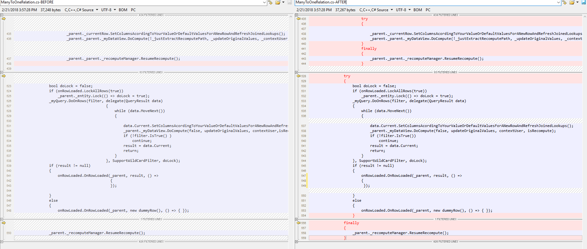


# Fix Recompute Issue regarding Locking and Relation

### Affetced version ###
Any version before 30124 (Feb 21st 2018).

### Symptom ###
The user cancel in respond to a locked row message (by pressing Esc or F2) and the program has a Relation to the locked table.  
In some cases, the recompute engine may enter an unstable state.

### Resolution ###
Updating to version 30124 (Feb 21st 2018) or later resolves the issue. 

If you need to apply the fix to your current source code of the Firefy.Box.dll, the changes are in the Engine\ManyToOneRelatino.cs. Please follow the changes below:

