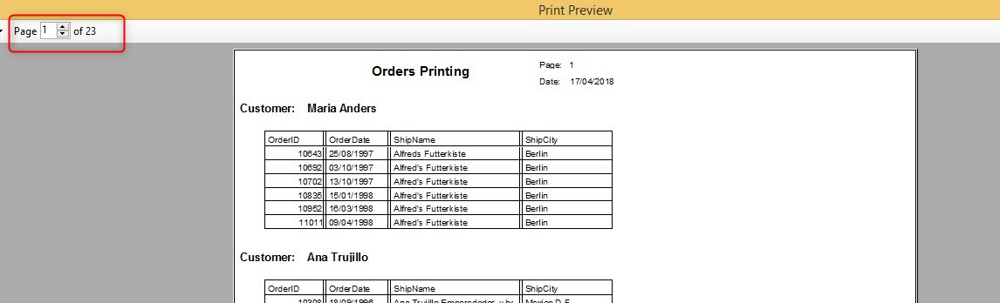
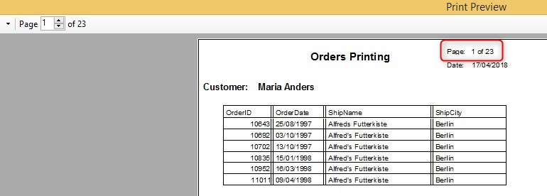

# Printing the Total number of pages on every page

You probably know that when using the print preview, you know how many pages the report has:


But what about the report itself? How would you like to be able to print this information on every page?  
Well - from now on you can :-)

In order to do that we will need to modify our report controller:  
1. Add the new `TotalPagesPlaceholderToken` property to the list of PrinterWriter properties.
This is a text property that contains a token, a value that will be used later and will replace this value with the number of pages of the report.  
For example:
```csdiff
_ioPrint_Order = new ENV.Printing.PrinterWriter()
{
    Name = "Print - Order",
    PageHeader = _layout.Header,
    PrinterName = Northwind.Shared.Printing.Printers.Printer1.PrinterName,
    PrintPreview = true,
+    TotalPagesPlaceholderToken = "!Total"
};
```
2. Now we can use this token in the method that returns the page number and the total number of pages.  
Before:
```csdiff
-internal Number Exp_2() => _ioPrint_Order.Page;
```
After:
```csdiff
+internal Text NumberOfPage() => _ioPrint_Order.Page + " of !Total";
```
>The previous method, Exp_2, is not used anymore. Instead the NumberOfPage method is used, returning Text that contains both the current page number and the token for the total number of pages that we set earlier. 

3. Don't forget to edit the layout, so it will use the new method  

4. Run the report and see the new design:  


> This requires more memory, as the report is printed first to the memory. Consider using this property when printing complex reports (containing images for example) or reports with a large number of pages.

A video showing how it works:
<iframe width="560" height="315" src="https://www.youtube.com/embed/JQ0KVr1Ckgg" frameborder="0" allow="autoplay; encrypted-media" allowfullscreen></iframe>

A video explaining how to implement total number of pages in ENV:
<iframe width="560" height="315" src="https://www.youtube.com/embed/KZZNWJaGuDA" frameborder="0" allow="autoplay; encrypted-media" allowfullscreen></iframe>
