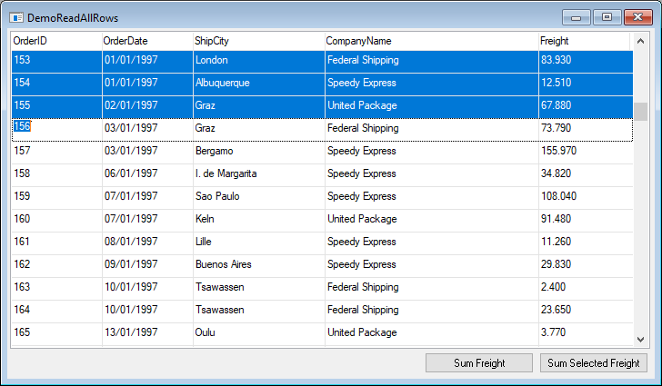

keywords: ReadAllRows, ReadSelectedRows

# ReadAllRows
## The Problem
In many cases we need to iterate all the rows that are currently displayed on the screen. 
For example, suppose we have a list of orders, we may want to sum the freight of all the orders in the grid. 
Notice that the list may be filtered by a calculated value (i.e. estimated shipping date) 
or by a value from a relation (i.e. shipping company name). 
We need to take this filter into account when summing the freight.


## The ReadAllRows Method
In the migrated application, every controller has a method named ReadAllRows, which iterates all the rows that are currently part of the controller's data view.
This methods accepts an action, in which we can do whatever we want with each row. We can update the rows values, print it or just count it.
Here is an example for summing the freight:
```csdiff
public class DemoReadAllRows : UIControllerBase
{
    public readonly Models.Orders orders = new Models.Orders();

    public DemoReadAllRows()
    {
        From = orders;
        Where.Add(orders.OrderDate.IsGreaterOrEqualTo(new Date(1997, 1, 1)));
    }

+    public void SumFreight()
+    {
+        Number sum = 0;
+        ReadAllRows(() => sum += orders.Freight);
+        MessageBox.Show(sum.ToString());
+    }
```

# ReadSelectedRows
In case we need to sum only the selected rows, we can use the grid method "ReadSelectedRows". For example, the user selects the first 3 rows:



Here is the code for summing just the selected rows:
```csdiff
        private void btnSumSelectedFreight_Click(object sender, ButtonClickEventArgs e)
        {
            Number sum = 0;
            grid1.ReadSelectedRows(() => sum += _controller.orders.Freight);
            MessageBox.Show(sum.ToString());
        }
```
