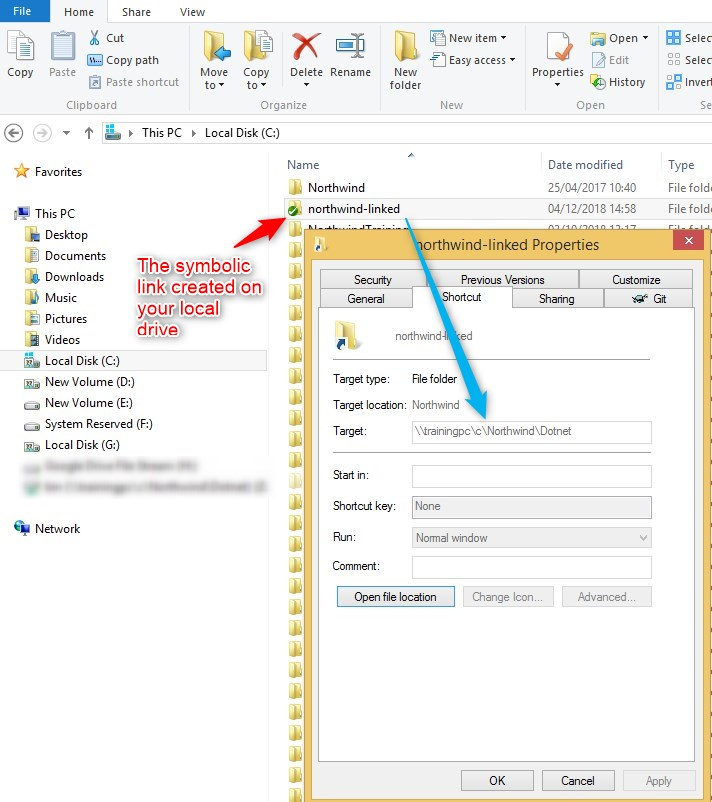

keywords: SEHException, AppRunner, Crash, System.Interop.Services.SEHException, SEH, Exception,The process was terminated due to an unhandled exception

## Introduction
We've recently received reports from clients that experience intermittent crashes of .NET applications, when running from a network location or a mapped drive, possibly under Remote Desktop session.

## Symptoms
When you run the application from a mapped drive or a network location, the application crashes during execution.
The error details, which can be found the in Windows Event Viewer are similar to the following:
```csdiff
Framework Version: v4.0.30319
Description: The process was terminated due to an unhandled exception.
Exception Info: System.Runtime.InteropServices.SEHException
```

## The Cause
This is a known Microsoft issue in Windows Server 2008 and Windows Server 2012, as described in [this article](https://support.microsoft.com/en-gb/help/2536487/applications-crash-or-become-unresponsive-if-another-user-logs-off-a-r)


## Our Solutions
1) We've developed a small utility called AppRunner, which allows you to run the application from a network location, without having this issue.
You can download AppRunner from [this link](https://github.com/FireflyMigration/AppRunner/releases)

For details about how to use it please refer to the [ReadMe page](https://github.com/FireflyMigration/AppRunner/blob/master/README.md)

2) Using mklink to create a symbolic link.

Symbolic link are used to create a local folder that points to a remote server folder.

The folder created by the Symbolic links are transparent to users. and appear as normal local folder.

Using the mklink command allow you to point your user to the exe file on its local Hard drive.


This method allow you to enjoy the two worlds :

1. The application will be running form the local HD and the problem is resolve.
2. You do not need to copy the application to your user local drive, every time you have a new version.


To implement this please open command line window, and run this command :
```csdiff
mklink /D c:\northwind-linked \\trainingpc\c\Northwind\Dotnet" 
```

/D  = Switch creates a directory symbolic link.

c:\northwind-linked = the name of the new folder that will be created for you on your hard drive.

\\\\trainingpc\c\Northwind\Dotnet = remote folder that have the application files.

Now you can see on your local hard drive a new folder named northwind-linked, and you can run the application from there.



If needed you can create a northwind.Bat file that will do that for the end user:
```csdiff
If not exist c:\northwind-linked mklink /D C:\northwind-linked \\trainingpc\c\Northwind\Dotnet

c:
cd c:\northwind-linked
start northwind.exe /ini=northwind.ini
```

