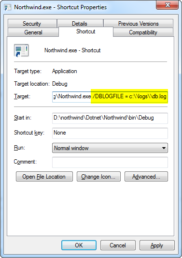

# Using Log Files

## Introduction

When users report errors, log files can be useful if not essential in different scenarios of the debug process, adding valuable information for debug analysis. This information may refer to data related issues or a run time crash. The information may also serve as a record of operations executed thus far.

Windows Form applications use two log files that provide information; the Db log file and the General Error log file. Web applications can use these two log files as a well as the Request log file. This article explains the configuration settings required for using log files. To configure log file settings, use the appropriate INI file or alternatively, use command line arguments. Details of both are discussed below.

## INI Configuration Settings

The following lines can be put in the INI configuration file, in the ENVIRONMENT section:

- **GENERALERRORLOG** = *filename** - This setting will output all errors that occurs during the application execution to a text file. (Example: GENERALERRORLOG = c:\myDir\error.log)
- **DBLOGFILE** = *filename* - This setting will output all the SQL statements to a text file. (Example: DBLOGFILE = c:\myDir\DB.log)
- **DBDEBUG** = Y - This setting will output all the SQL statements to the Output window in Visual Studio.
- **DBNOPARAMS** = Y - This will suppress the use of parameters which will make the SQL statement easier to read.

Note: The above settings should only be used for debug purpose and not be used in production environments.

## Command Line Arguments

As with any setting from the INI file, the log files settings can be set using a command line arguments.

In case of using a shortcut to execute the application, the command line arguments should be added at the end of the Target box as displayed below.

Notice that in this case, a double slash is needed in the file path, as opposed to putting the settin in the INI file. This can be avoided by using a star (*) before the file path, for example: /DBLOGFILE=*c:\logs\db.log



In the Target shortcut, you may add the following arguments at the end of the command:

/GENERALERRORLOG = filename /DBLOGFILE = filename /DBDEBUG = Y /DBNOPARAMS = Y

# Log Files Usage

## Db Log File

The DB Log file contains all the data regarding SQL transactions with the Database. This data is identical to the SQL that is displayed in the Output Screen, when running an application. For full details regarding the syntax and layout of the SQL statements, see: [Relations in Depth](Relations-in-depth) and [Viewing SQL Output](view_sql_output.html).

## Error Log File

The Error log file contains all the data related to run time Error Messages. For more information regarding the syntax,layout and different sections that may appear in Error Messages, see: [Viewing Error Messages](Understanding-Error-Message-Details.html).

## Request Log File

For programs that operate through an Internet browser, use the REQUESTLOGFILE setting to record the names of programs executed as well as other statistics about their execution. The Request Log File is a file used by web applications, which records all the programs that are run using a browser. The following shows an example of the request.log containing details for three programs that have so far been executed.
```
Request 1(ShowOrders) - Begin Process, class Northwind.WebTraining.ShowOrders
Request 1(ShowOrders) - Success, Duration.: 97.0056
Request 2(DisplayOrder) - Begin Process, class Northwind.WebTraining.DisplayOrder
Request 2(DisplayOrder) - Success, Duration: 46.0027
Request 3(UpdateOrder) - Begin Process, class Northwind.WebTraining.UpdateOrder
Request 3(UpdateOrder) - Success, Duration: 43.0024
```
# Remarks

Note that using log files affects the performance of the application and should therefore only be used when necessary. Also note that log files are cumulative in respect of adding further comments as they occur. As such, if there is a need to keep a record of the log files for a specific incident, it is useful to make a copy of the files at that point so that they can more easily be used as a point of reference in solving that issue.