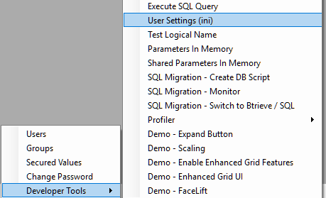
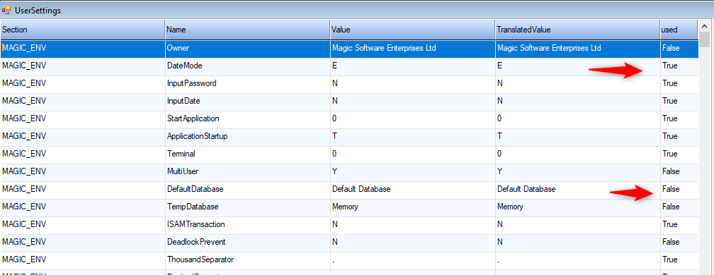

keywords:magic.ini, ini , configuration file

Many customers after the migration to .NET want to remove unnecessary entries from the ini file - and we are commonly asked how to do so, so here are our recommendation on the matter.

### Test using the same ini you use today in magic
When you are testing and even deploying to Beta - we recommend that you test using the same ini that you use today in magic - this prevents all sorts of problems and issues.

Many times we had issues that were very hard to investigate only to find out that the root cause was that the customer used a different ini file between the magic environment and the migrated .NET application.

### Move ini entries to code
We recommend that you wait for the ini cleanup, until the point where you start making changes in the .NET code. 
There are many entries in the ini that shouldn't be there - and the fact that they are currently in the ini, and a user can change them can cause serious risk to the application.
Imagine if one of your customers changes the `AllowUpdateInQuery` ini entry - it would change the way your application operates and locks rows in ways that are very hard to track.

### Finding out which entries are in use
In the Developer tools\User Settings menu there is a very useful tool that shows all the entries in the ini, including their Section, name, value, translated value and if they've been used by the application so far.

The used column will display true for entries that were readen by the application so far, and false for any other entry.

**Developer tools\User Settings menu**

**User Settings Screen**

### The UserSettings class
The code that is responsible to reading the ini is in a class called `UserSettings` in the `ENV` project. In it there is a switch statement that reads reads the ini entries and maps them to properties and behaviours in the code.

