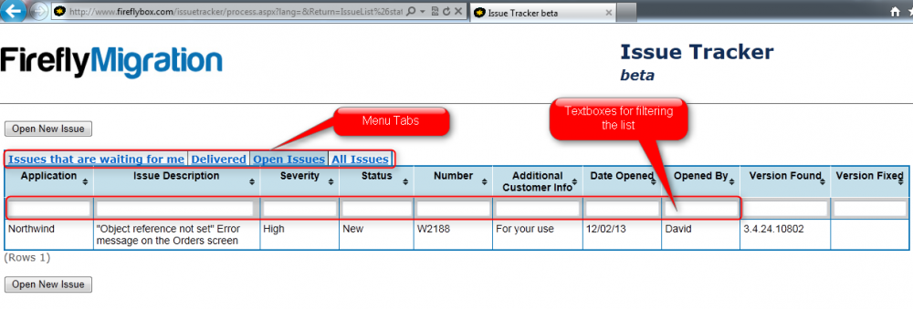
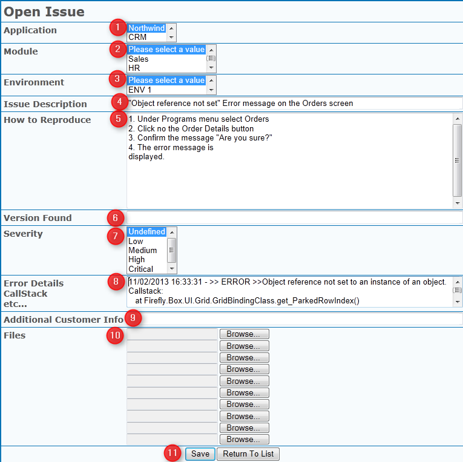

# Using IssueTracker

This article explains how to report issues to Firefly using Firefly's IssueTracker website. The IssueTracker is used to report any issue that was found in the migrated application and that cannot be reproduced in the magic version of the application.

## Login to IssueTracker

Login to [IssueTracker](http://www.fireflybox.com/issuetracker/) website, using the account details provided by Firefly.

## The Main Screen

After logging in successfully, the main screen will be displayed with the following tabs:

- **Issues that are waiting for me** - Issues that are waiting for your response.
- **Delivered** - Fixed issues that are waiting to be tested and closed by you.
- **Open Issues** - All the open issues that are currently in progress at Firefly.
- **All Issues** - A complete list of all the issues, including open and closed issues.

Each list can be easily filtered or sorted, using the headers and textboxes at the beginning of the table.

## Opening a New Issue

Once an issue was found in the migrated code, please make sure that the issue does not exist in the magic version.

Clicking on the “Open New Issue” button will show the “Open Issue” screen. In this screen, you can provide information about the issue, by filling in the following fields:

1. Select the application the issue is related to. (For users who have more than one application).
2. Select the Module where the issue was found. (For an application that has modules information).
3. Select the Environment the issue was reproduced in. (For an application that has more than one environment).
4. Add a description
5. Explain how to reproduce the issue, using short and clear instructions, like “Go to this menu”, “click that button” etc. Please include all the steps necessary to replicate the issue and all the data that was entered or selected. Also, make sure that the issue can be replicated on the test environment that was provided to Firefly.
6. Enter the number of the version that the issue was found in. This number is shown in the application status bar.
7. Select the severity of the issue, according to the following guidelines:
    - **Critical** - Describe Issues that completely prevent you from continue testing, or crucial issues in production.
    - **High** - Describers a crash or data compromising issue that has a workaround.
    - **Medium** - The migrated application behaves different from the original version.
    - **Low** - Describes minor ui issues.
8. The Error Details field is used for providing the error details in case of a crash or for providing logs in case of database related issues or other helpful log information. In any other case press CTRL+F12 in the migrated application to get the callstack of the current location. This info should be copied to the Error Details field.
9. Additional Customer Info - A free text field that you can use for your own information
10. Files - Used for uploading screenshots (Preferred) or videos that emphasizes the issue.
11. Click on the save button.

## Updating an Issue

If the issue report is missing needed information for replicating it, the issue will be on the “Issues that are waiting for me” list, with and appropriate message in the “Status” field. You can update the issue and add the needed information by clicking on the issue line in the list, which will open the following screen:

In this screen you can add the information in the “Status Update Info” field and then to change the status of the issue to “Return to Firefly”.

Here are the possible statuses for issues that are in this list:

- **Further Details Required** - The replication procedure is missing steps or other information needed for replicating the issue.
- **Couldn't Reproduce** - The Issue could not reproduced in Firefly's environment and the application behaves as the original application.
- **Reproduced in Magic** - The issue exists in the magic version as well.
- **To be Fixed by Customer** - The issue is a result of something that need to be fixed in the original application.
- **Will not be Fixed** - This is an intended difference (usually an improvement behavior or look and feel of the .net version).
- **Checked** - The issue was fixed and tested by Firefly and is pending for delivery.

## Closing an Issue

Once an issue has been fixed and ready to be tested by you, it will be marked with the “Delivered” status and will be listed under the “Delivered” tab. A fixed issue will have the number of the version that it was fixed in updated in the issue ticket. Once the issue is tested and resolved, you should close it by changing its status to “Closed Issue”.