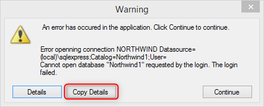
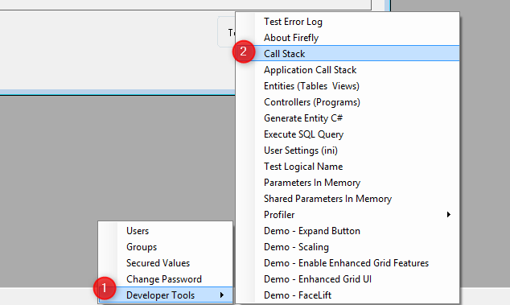
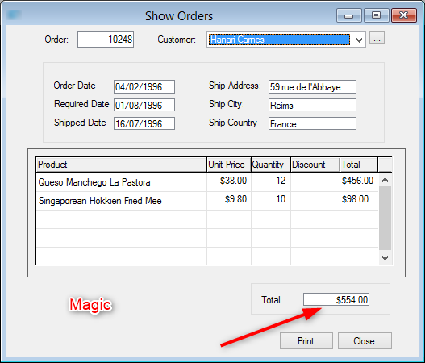
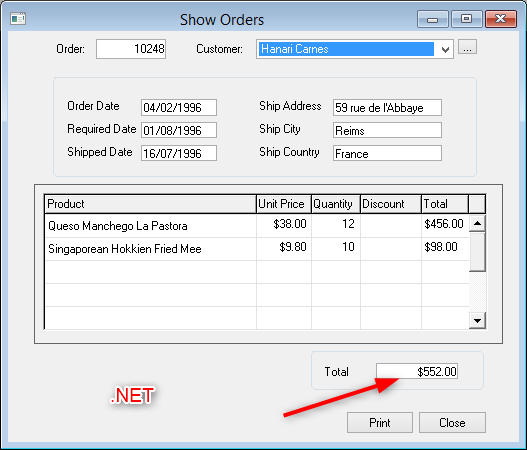

keywords: issue,ticket, tracker, issue tracker

A good issue report must include:
1. A Step by step description for someone who is not familiar with the app.
2. Error details with the exception details or a call stack of the screen if there is no exception.
3. A screenshot of the result in magic
4. A screenshot of the result in .NET
5. If it's a process - a profiler file for that process.
6. One problem per issue


## Step by step description
We do not know or understand the deferent business domains of each appliaction, we need a set of steps that anyone can follow without any understanding of the application domain and language.

#### Example of a good report
```
1. Menu Program
2. Menu Orders
3. Click Ctrl R
4. type  order 10248
5. Click Enter
6. You should see the order information of order 10248

Magic result - order total is 554
.NET result - Order total is 552
```

#### Example of bad  report
```
Goto any order, the total is incorrect.
```


### Error details or Call stack
When you get an error - click "Copy Details" and paste it



If there is no error include the callstack (by default Ctrl-F12 for most applications)
or from Developer tools menu



In case you do not see the Developer tools menu, please refer to:  
http://doc.fireflymigration.com/access-developer-tools-and-users-management-menu.html


### Screen shots
We need to make sure that we see what you see - and without screenshots that is a lot harder.
We use a cool tool called <a target=_new href="https://www.screenpresso.com/">Screenprosso</a> to take screen shots but you can use any tool.  
It's important to include a screen shot in magic and in .NET so that we can clearly see the problem.

#### Screen shot examples



### Profiler
Profiler log is essential especially when a process is involved.   It is a good practice to attach it anyway for every issue.  
Please refer to: <br>
http://doc.fireflymigration.com/using-firefly-profiler.html


> In case the issue is related to perfomance, please include time in Magic and time in .NET 

<br><br>

For the complete guide of how to report an issue, please refer to:  
http://doc.fireflymigration.com/using-issue-tracker.html  
