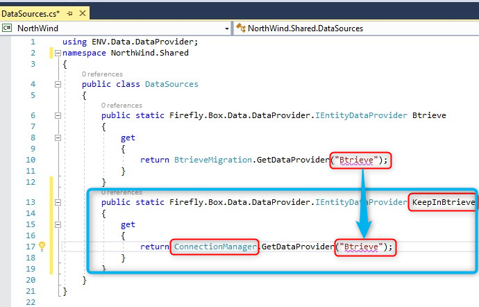
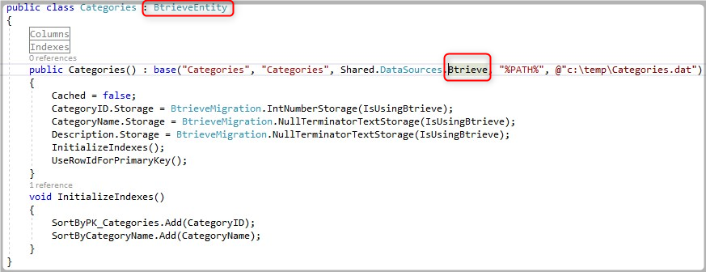

# Keep using some of the application tables in Btrieve after the SQL Migration
In same cases we would like to work in SQL but also keep some tables in Btrieve, this is needed when some of our tables are shared with other applications.
In this case we will need to change the DataSource of these tables in order to keep working with them in Btrieve.

## Change the DataSource

1. First we will need to add the new DataSource to our migrated application.
2. Below is the DataSource of a migrated Northwind application

3. Now Let's add a new DataSource
   1. Notice the name "KeepInBtrieve"
   2. Notice that the new entry using ConnectionManager.
   3. Notice that "GetDataProvider" points to the same "Btrieve" as the original one

## Set The Tables that we would like to keep working with Btrieve

1. Change the table DataSource from Btrieve to KeepInBtrieve

2. Now when you run your application the data for "Categories" will be based on Btrieve, and the rest of your tables will be based on SQL

