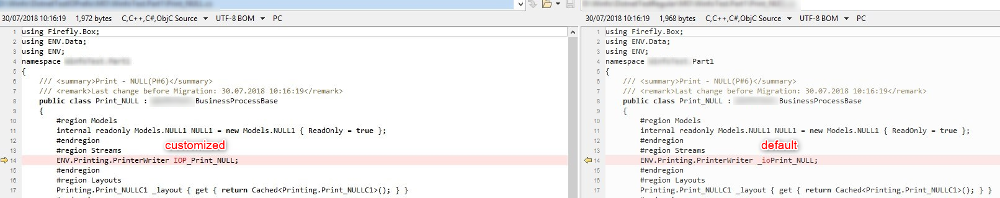
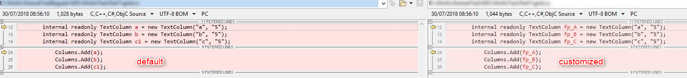
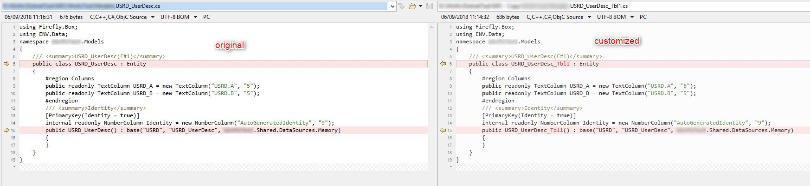
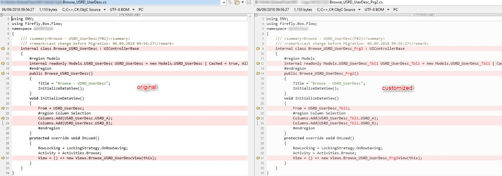
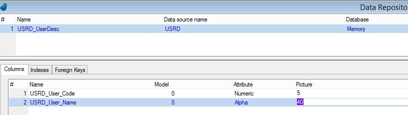
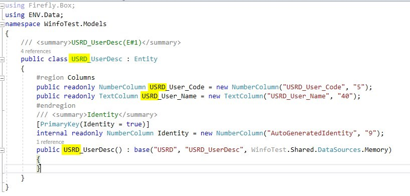
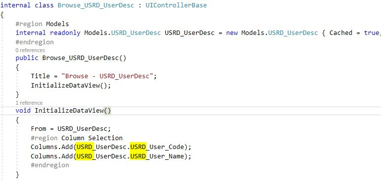
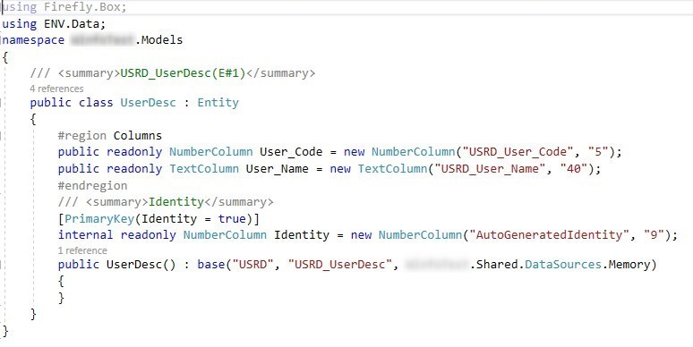
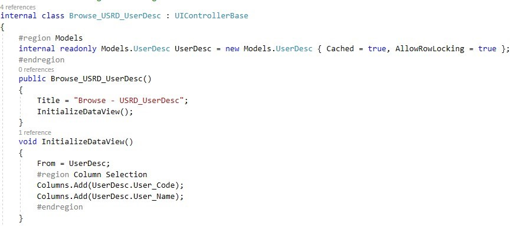

keywords: customize, custom, code, final, migration, program, name, table, number, prefix

# Customize the code before the final migration

Just before you are about the perform the final migration of your code and switch to .Net, we can offer you some additional  
options that will allow you to fine-tune your code, adjust it to suit your needs.

The first part of the code adjustment is the namespaces - you can read more about it in the [Splitting an application into smaller parts](http://doc.fireflymigration.com/splitting-an-application-into-smaller-parts.html) article.

## Add a prefix to an IO definition
By default, any IO (stream) defined in a class will get the <code>_io</code> prefix.  
You can ask for an IO prefix of your choice - this is an example of how it will look before/after:

## Add a prefix to a local column
The virtual fields (columns) names are not changed during the migration.
In Magic it was not simple to differentiate between a virtual and a real field (from a table).
In the migrated code it is clearer - any table column will have the entity (table) name prefixed
(e.g <code>myTable.myColumn</code>).  
However, you can ask for a prefix to a local column - this is an example of how it will look before/after:

## Using the table / program number in the class name
In Magic a table / program is referenced by its number. In the migrated code they are referenced by their class name.  
However, we know that a lot of Magic developers remember the table / program numbers by heart and would like to keep the reference to the number in the migrated code. These numbers can be added to the class name - as a prefix or suffix.
This is an example of how it will look before/after:
#### Table

#### Program

## Modify the table / column name
Adding the number is just one form of change that can be done to the name. There are other manipulations that can be made.  
One example would be something we have come across in several cases - table names include both the table short name in the database and the caption.
For example: USRD_UserDesc.
This was also used in the column names, so the table short name is prefixed to each column.
For example: USRD_User_name.
In Magic, it was done for obvious reasons - this was a quick way of recognizing the table each column belongs to without having to look for it.
This is an example of how it looks in Magic:  

This is an example of how it looks in the migrated code:
#### Table

#### Program
  

As mentioned, in the migrated code, any column is references by its entity (table) name, so
removing the short name prefix will improve the look & feel of the code, giving it a "neat" look.  
This is how it will look after the change:
#### Table

#### Program

This is just one example. As you can see there are various ways to influence the way the migrated code will look - we encourage you to consider these type of changes. Enjoy :)
