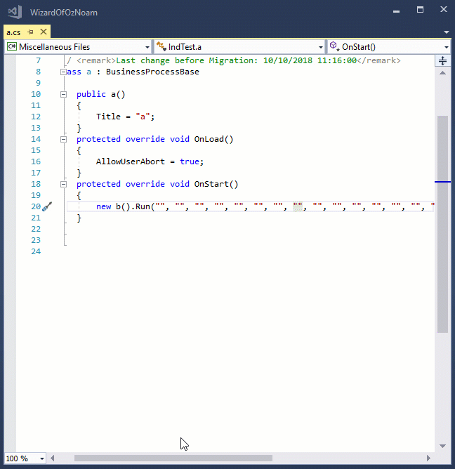
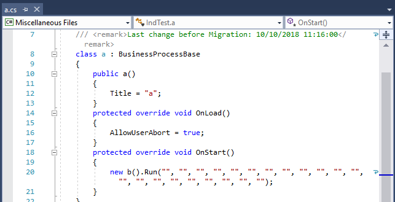
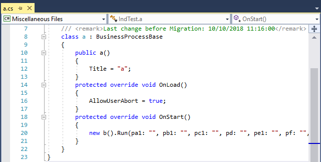
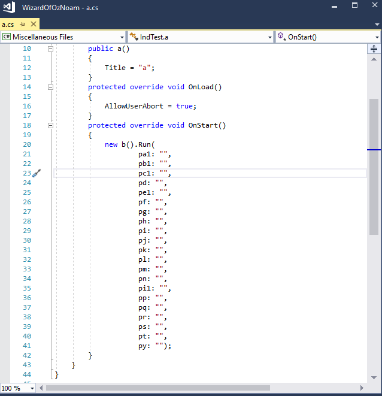
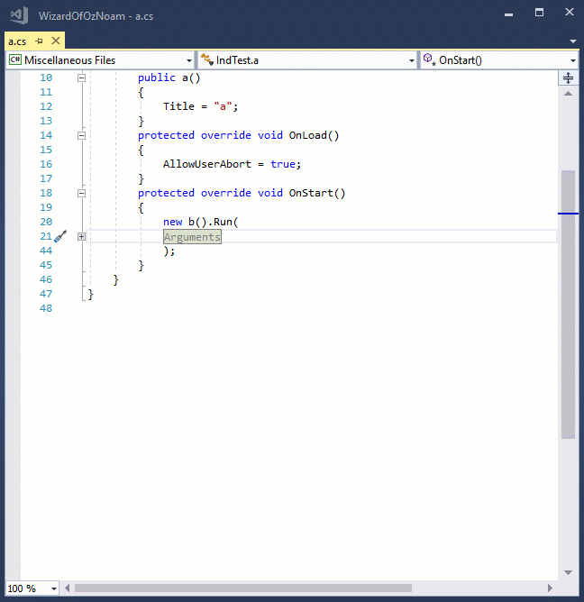

Sometimes in the migrated code you may find a call to a controller ("program" in magic) with many arguments.

By default all the arguments are migrated in a single line, as follows - which may sometimes require you to scroll horizontally.

Of course you can define word wrap in Visual Studio (`Menu:Edit\Advanced\word wrap`), and it'll look like this:

## Migration Optimization options
Since different developers prefer different options we've added several configuration flags that can help make this clearer

### Named Parameters
The migration engine can be configured to migrate the names of parameters as well - to make it easier to identify which value is sent to which parameter.
You can choose to include the names if a controller receives more than X parameters(a value that you can choose) and it'll look like this:

> of course you can also use it with word wrap.

### Each Argument in new line
The migration engine can be configured to migrate the each argument in a new line.
You can choose to do that when a controller receives more than X arguments(a value that you can choose) and it'll look like this:

> you cal also do this without named parameters if you choose

### Wrap multi line parameters with a Region
Since each parameter in a new line can be cluttering, you can also choose to put long argument lists in a region.

### Let us know what you prefer
Please ask your technical contact at Firefly to configure it based on your requests. Feel free to change it and play with it until you get what you like