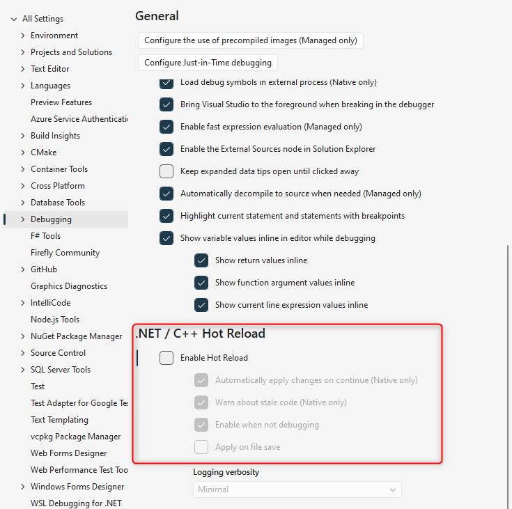
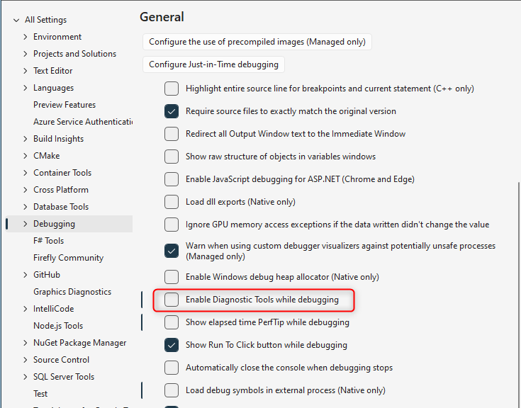
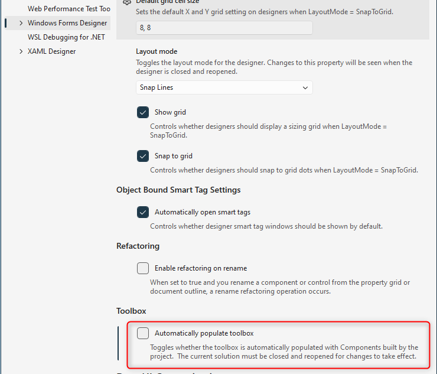
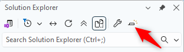
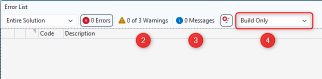

keywords:Symbols for the module 'ENV.dll' were not loaded, VisualStudioTemplates, Templates, VSDropAssist, Class Outline, Extensions, Bundle, visual studio configuration,configure visual studio,visual studio 2026,2026,config

In this document we detail how we configure Visual Studio 2026 to make the most out of it while working with large migrated applications.

For previous versions of Visual Studio please refer to our existing guides:   
[Configuring Visual Studio 2022](http://doc.fireflymigration.com/configuring-visual-studio-2022.html)    
[Configuring Previous versions of Visual Studio](http://doc.fireflymigration.com/configuring-previous-versions-of-visual-studio.html)

## A - Visual Studio Extensions
We provide a Templates extension built for Visual Studio 2022 that is also compatible with Visual Studio 2026, as VS 2026 supports most VS 2022 extensions without changes.

Please downdload and install the VSIX file:   
[Templates extension 2026](https://github.com/FireflyMigration/VisualStudioTemplates2022/releases)

## B - Performance-oriented settings in Tools → Options
All the following settings are under *Tools > Options* in Visual Studio 2026

### B.1 - "Debugging" Tab
Go to *Tools > Options > Debugging > General*
#### B.1.1 - Uncheck "Warn if no user code on start debugging (Managed only)"

This eliminates the "Symbols for the module 'ENV.dll' were not loaded" message you get every time you run the code

#### B.1.2 - Configure Edit and Continue via Hot Reload
Go to *Tools > Options > Debugging > General > .NET / C++ Hot Reload*   
In Visual Studio 2026, Edit and Continue is controlled through the **.NET / C++ Hot Reload** section instead of a separate "Enable Edit and Continue" checkbox.   
For improved stability, it’s recommended to leave this option unchecked.

#### B.1.3 - Uncheck "Enable Diagnostic Tools while debugging"
Go to *Tools > Options > Debugging > General*   
This reduces overhead from live performance and memory collection and usually **improves debug‑time performance**

### B.2 - set "Automatically Populate Toolbox" to False
Go to *Tools > Options > Windows Forms Designer.*   
Set Automatically Populate Toolbox to False, which avoids toolbox rescans after each build and speeds up work with large WinForms projects.

### B.3 - Disable IntelliTrace (Enterprise edition only)
Go to *Tools > Options > IntelliTrace​*   
Uncheck the "Enable IntelliTrace" checkbox   
Disabling IntelliTrace reduces debugger overhead and **Improves performance** when running in Debug

### B.4 - Editor outlining preferences
Go to *Tools > Options > Languages > C# > Advanced > Advanced (link)​*   
Check the "Collapse #regions when collapsing to definition" check box, under "Outlining"  

  

### C - Disable "Preview Selected Item"
In the Solution Explorer window, make sure the Preview Selected Items icon (the small file icon with a magnifying glass) is not highlighted.​   
Disabling this prevents Visual Studio from constantly opening preview tabs as you move through the tree, which is helpful in large solutions.   

### D - Add the parameter information toolbar item
1. Open any .cs file so the code editor toolbar is visible 
2. Click on the 3 dots icon ... at the end of the toolbar to open the "Customize" dialog
3. "Add or Remove Buttons" → enable "Parameter Info".

This shows method parameter info for the symbol under the caret:

### E - Configure the "Error List..." Window
1. Go to "View\Error List" menu  

2. Uncheck the "Warnings" tab by clicking on it (Our preference, not mandatory)
3. Uncheck the "Messages" tab by clicking on it (Our preference, not mandatory)
4. Set the combo to "Build Only"  

