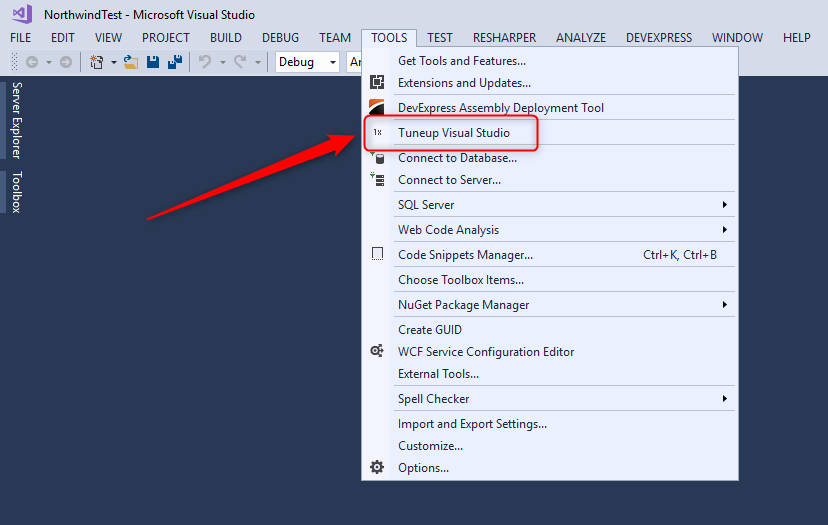
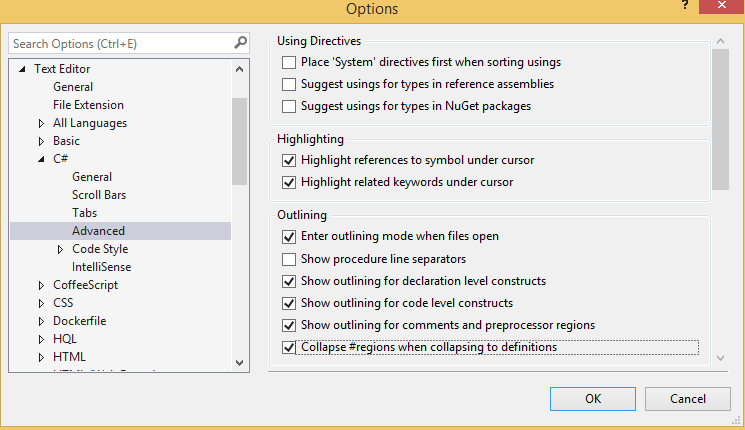
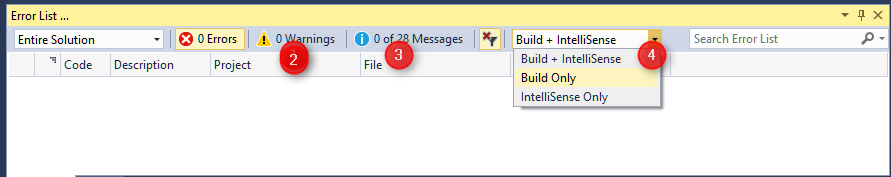
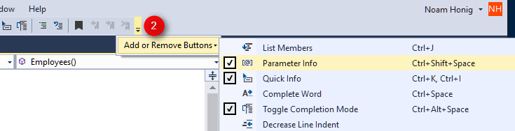

keywords:Symbols for the module 'ENV.dll' were not loaded, VisualStudioTemplates, Templates, VSDropAssist, Class Outline, Extensions, Bundle

In this document we'll detail how we configure Visual Studio 2017 to make the most out of it while working with large migrated applications.

Although this document was written with Visual Studio 2017 in mind, most of it is also relevant to previous versions of Visual Studio.

These are the extensions and settings we use - since they are our preferences none of them are mandatory but they are highly recommended.

## A - Visual Studio Extentions
Please download and install our Extensions Bundle from [here](https://marketplace.visualstudio.com/items?itemName=Firefly-Migration.VisualStudioExtensionBundle)
The bundler will install the following extension:

1. [Class Outline](https://marketplace.visualstudio.com/items?itemName=Firefly-Migration.ClassOutline) - A tool that shows you a window with all the classes and inner classes in a C# code file.
When you right click on any node, you'll see the different important methods of it, such as OnStart etc... and will also be able to go directly to the controller's view
2. [VS Drop Assist](https://marketplace.visualstudio.com/items?itemName=Firefly-Migration.VSDropAssist) - Allows for drag and drop of various objects from the solution into the code.
3. [Visual Studio Templates](https://marketplace.visualstudio.com/items?itemName=Firefly-Migration.VisualStudioTemplates) - Install item templates, snippets and help tune up Visual Studio. 

## Important:
After installing the extensions, open Visual Studio and under the Tools menu, select "Tuneup Visual Studio" and click Yes
In case you can't install the extension, follow the manual instructions [here](http://doc.fireflymigration.com/Manually-install-Templates-and-Snippets.html)

## B - Other important settings that improve the performance and experience in Visual Studio
The following settings are in the  "Tools\Options" menu

#### B.1 - Uncheck "Enable Diagnostic Tools while debugging"

**Improves performance** when running in Debug
### B.2 Disable IntelliTrace
1. Go to the "IntelliTrace" Tab
2. Uncheck the "Enable IntelliTrace" checkbox

**Improves performance** when running in Debug
### B.3 Check "Collapse #regions when collapsing to definition"
1. Go to the "Text Editor\C#\Advanced" Tab
2. Check the "Collapse #regions when collapsing to definition" check box, under "Outlining"  
  
**Improves performance**
### C - Configure the "Error List..." Window
1. Go to "View\Error List" menu  

2. Uncheck the "Warnings" tab by clicking on it (Our preference, not mandatory)
3. Uncheck the "Messages" tab by clicking on it (Our preference, not mandatory)
4. Set the combo to "Build Only"  

### D - Disable "Preview Selected Item"
In the "Solution Explorer" window make sure that the "Preview Selected Item" Icon is not checked (highlighted)  

### E - Add the parameter information toolbar item
1. Open any class 
2. On the toolbar
3. Click on the icon highlighted in the image as 2  

4. Select "Add or Remove Button"
5. Select the "Parameter Info" Tool box item.

This adds the following toolbox item, that will show you the parameter information for a method you are parked on

1. 
2. 

### F - Configure the "GoTo" window
Go To the "Edit\Go To\Go To All..." menu item  

1. Click the "Settings" button  

2. Uncheck the "Use Preview Tab" CheckBox
3. Check the "Show details" CheckBox

### G - Recommended extentions
We would like to recommend the follow extension to you:
[Stack Trace Explorer](stack-trace-explorer.html)
