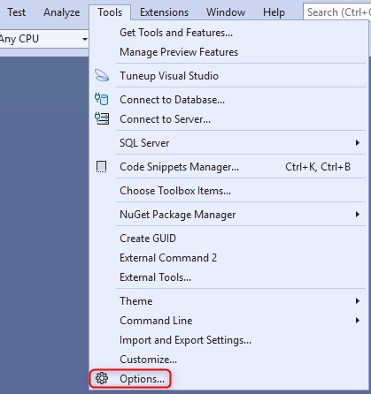
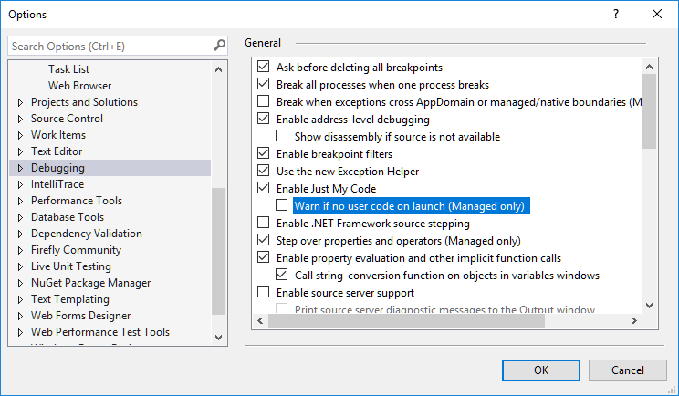
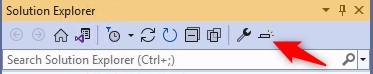
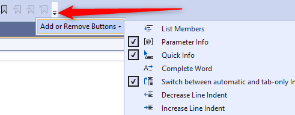
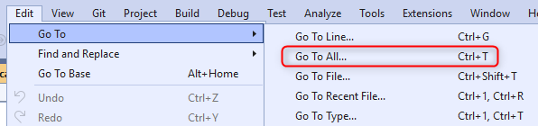
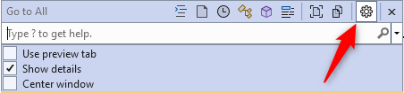
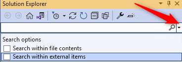
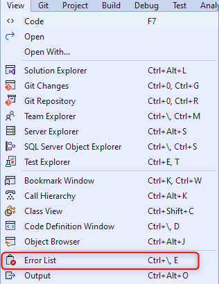
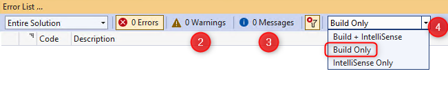

keywords:Symbols for the module 'ENV.dll' were not loaded, VisualStudioTemplates, Templates, VSDropAssist, Class Outline, Extensions, Bundle, visual studio configuration,configure visual studio, visual studio 2019,visual studio 2022,2022

In this document we'll detail how we configure Visual Studio 2022 to make the most out of it while working with large migrated applications.

For previous versions of Visual Studio please refer to:  
[Configuring Previous versions of Visual Studio](http://doc.fireflymigration.com/configuring-previous-versions-of-visual-studio.html)

## A - Visual Studio Extensions
We have created Templates extension for Visual Studio 2022.  

Please downdload and install the VSIX file:   
[Templates extension 2022](https://github.com/FireflyMigration/VisualStudioTemplates2022/releases)

## B - Other important settings that improve the performance and experience in Visual Studio
The following settings are in the  "Tools\Options" menu

### B.1 - "Debugging" Tab
#### B.1.1 - Uncheck "Warn if no user code on launch (Managed only)"

This eliminates the "Symbols for the module 'ENV.dll' were not loaded" message you get every time you run the code

#### B.1.2 - Uncheck "Enable Edit and Continue"

Allows you to edit your code, while the application is running

#### B.1.3 - Uncheck "Enable Diagnostic Tools while debugging"

**Improves performance** when running in Debug

### B.2 set "Automatically Populate Toolbox" to False
In the "Windows Forms Designer" tab

**Improves performance** after each build

### B.3 Disable IntelliTrace (Enterprise edition only)
1. Go to the "IntelliTrace" Tab
2. Uncheck the "Enable IntelliTrace" checkbox

**Improves performance** when running in Debug

### B.4 Check "Collapse #regions when collapsing to definition" (VS2017 only)
1. Go to the "Text Editor\C#\Advanced" Tab
2. Check the "Collapse #regions when collapsing to definition" check box, under "Outlining"  

  

**Improves performance**

### C - Disable "Preview Selected Item"
In the "Solution Explorer" window make sure that the "Preview Selected Item" Icon is not checked (highlighted)  

### D - Add the parameter information toolbar item
1. Open any class 
2. On the toolbar
3. Click on the icon highlighted in the image  

4. Select "Add or Remove Button"
5. Select the "Parameter Info" Tool box item.

This adds the following toolbox item, that will show you the parameter information for a method you are parked on

1. 
2. 

### E - Configure the "GoTo" window
Go To the "Edit\Go To\Go To All..."

1. Click the "Settings" button  

2. Uncheck the "Use Preview Tab" CheckBox
3. Check the "Show details" CheckBox

### F Uncheck the two checkboxes in the"Search options"
1. Open the solution explorer
2. Press the combo down arrow button to open the search options
3. Uncheck the two checkboxes  
  

**Improves search performance**

### G - Configure the "Error List..." Window
1. Go to "View\Error List" menu  

2. Uncheck the "Warnings" tab by clicking on it (Our preference, not mandatory)
3. Uncheck the "Messages" tab by clicking on it (Our preference, not mandatory)
4. Set the combo to "Build Only"  

