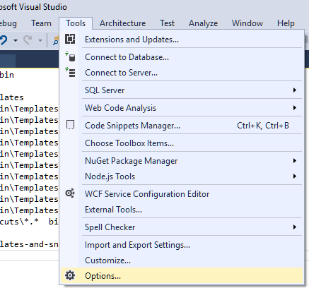
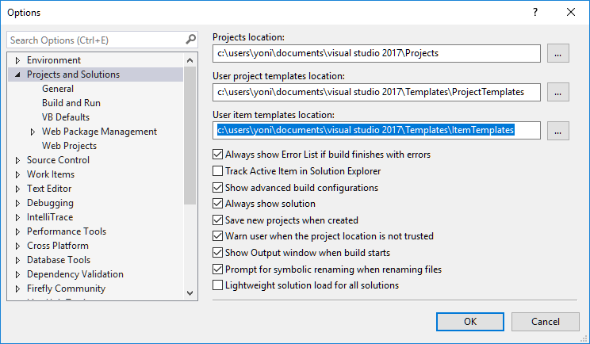
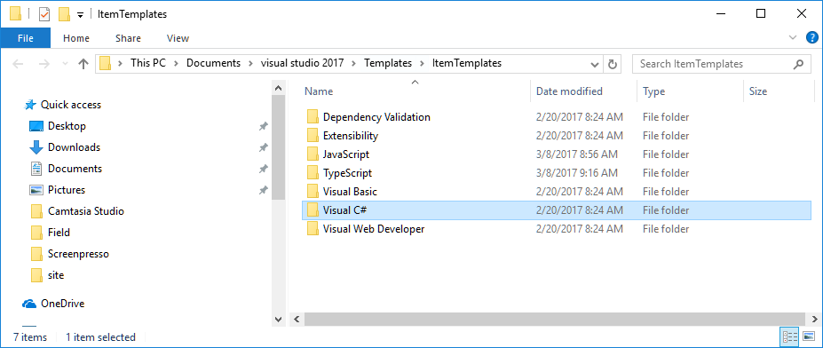
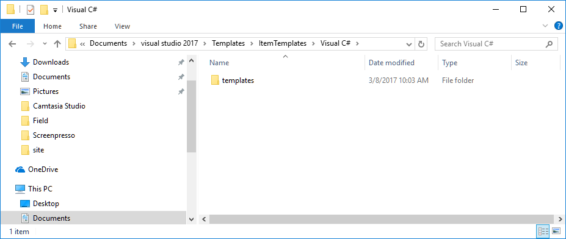
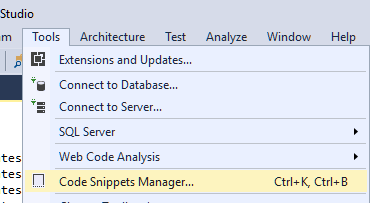
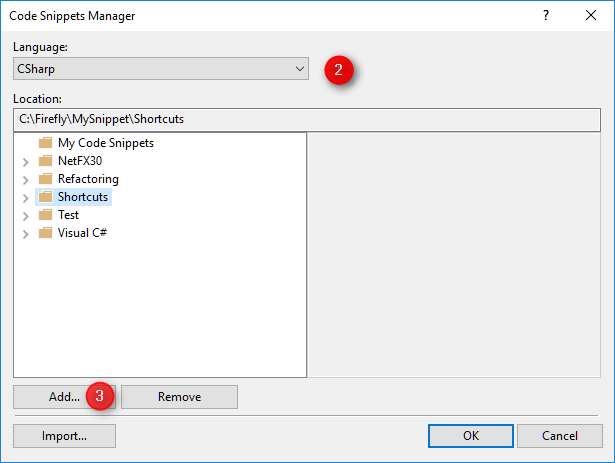


**Note**  
If you can install Visual Studio extensions, use the extension instead of following this manual instructions. Download the extension [here](https://marketplace.visualstudio.com/items?itemName=Firefly-Migration.VisualStudioTemplates)
After installing the extension, open Visual Studio and under the Tools menu, select "Tuneup Visual Studio" and click OK

## Visual Studio Templates
Download the latest templates-and-snippets.zip from [Here](https://github.com/FireflyMigration/VisualStudioTemplates/releases). 

### 1 - Placing the Templates folder
In Visual Studio: 
1. Open the "Tools\Options" menu  

2. Select "Project and Solutions"
4. Copy the path under "User item templates location" and open it in your file explorer  

5. Open the "Visual C#" folder  

6. Place the Templates folder from the downloaded zip file, in this directory  

### 2 - Placing the Shortcuts folder
You can place the shortcuts folder anywhere on your local machine - you'll just need to tell Visual Studio where to find it.
1. Goto the "Tools\Code Snippets Manager..." Menu

2. In the Language Combo select "csharp"
3. Click the Add... button
3. Select the "Shortcuts" folder that you've downloaded
 
