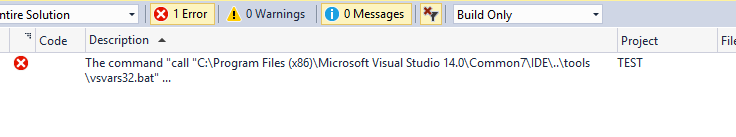
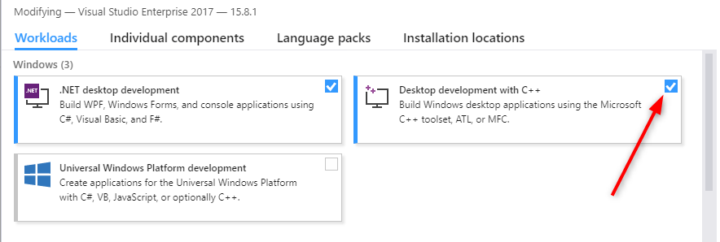

keywords: editbin, error, build

# Build error – “C:\Program Files (x86)\Microsoft Visual Studio 14.0\Common7\IDE..\tools\vsvars32.bat” editbin

In some cases, mainly when you upgrade VS, the build in 2015 will fail with the following message:

  
This is due to the fact that Visual Studio checks for the environment variable according to the installed VS.  
To overcome this issue, make sure the C++ Tools option in the installer is selected. By default VS2015 only installs C# and VB.net, but not C++ with its tools.

If you are using VS2017, during the installation, make sure to check "Desktop development with C++" 

 

 In both VS2015 and VS2017, you can configure this even after VS is already installed. Go to "Add/Remove Programs", Right-Click on VS installation -> you should get an option to modify the installation.