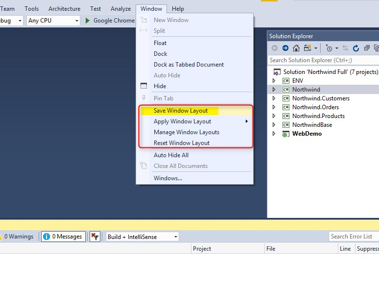
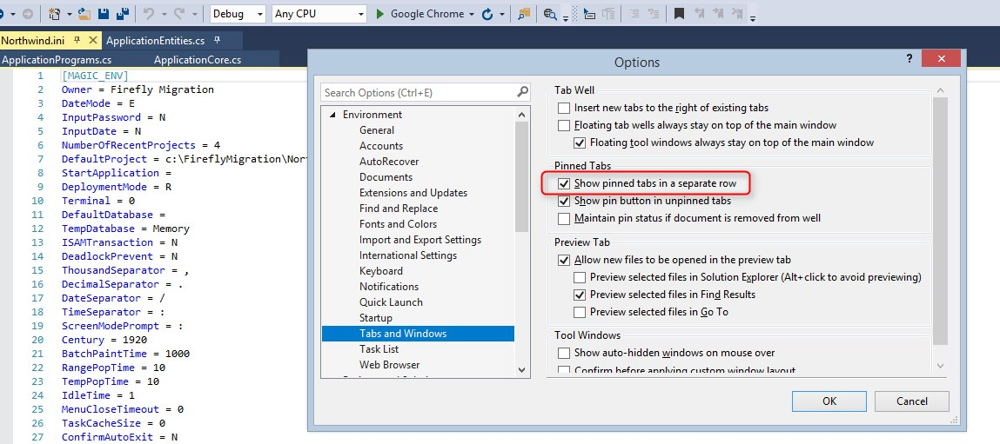

# Visual Studio Tips

There are many tips for the Visual Studio. We have collected some that you might find useful.

### Goto closing bracket
In many cases where there is a long if statement I see an open bracket and I want to see where it ends - just park on it and click <kbd>Control</kbd> + <kbd>]</kbd> and it'll get you there

### Scope to This

In case you have a large solution with many projects and you would like to concentrate on a particular project, you can use "Scope to This" which shows you only the project you selected. 

To go back, simply click on the blue arrow at the top left

## Save your current windows layout

As developers, we often like to work with specific layout of the Visual Studio windows (Error list, Output, Watch and etc) 
This nice feature, allows you to save the layout you like and come back to it on demand.
Note that you can have several layouts for different situations (development, debugging and etc)

Once you have your Windows layout saved, you can use it by selecting from the menu your layout "Apply Window Layout")

## Pinned tabs

While developing, usually we have several tabs open in the working area. If there is a tab which is often used, it is useful to pin the tab.
Doing so, will keep the tab visibly on the left regardless of the amount of tabs which are and will be added.

You can also set that the pinned tab will be in a separate row

## Shortcuts

Visual Studio is full of shortcuts. Below is the list: 

http://www.dofactory.com/reference/visual-studio-shortcuts

There is also a nice Add-on called "Hot Commands for Visual Studio" 

https://marketplace.visualstudio.com/items?itemName=JustinClareburtMSFT.HotCommandsforVisualStudio

