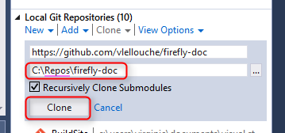
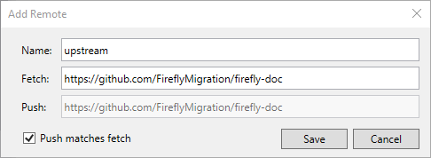
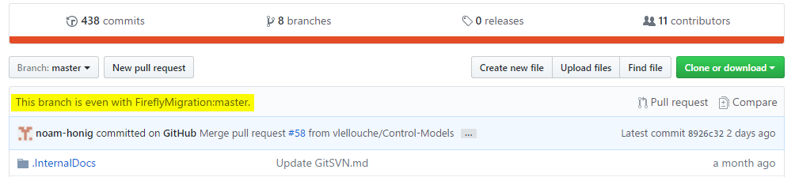
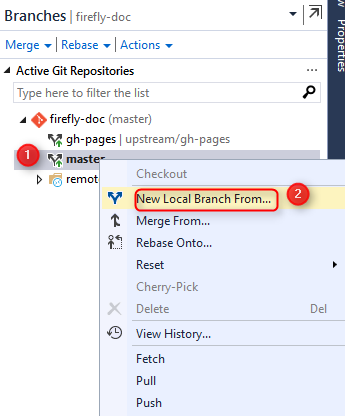
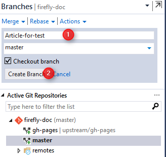
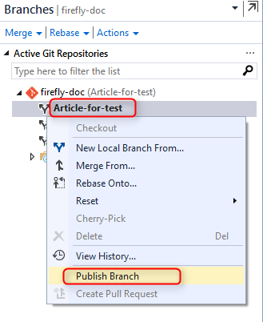

GitHub is a great place for open source project that you can contribute to.
One of them is the Firefly-doc repository which has all the developers documentation.
This article explain how to work with a repository that you have only read access using Visual Studio.

## Create a Fork on GitHub
If you don't already have a fork of the repository you can create one.  
1. Open a web browser to the GitHub project page (i.e. https://github.com/FireflyMigration/firefly-doc).  
2. Make sure you have a GitHub account and that you are logged in (your user avatar should appear at the top right corner)  
3. Click on the "Fork" button in the upper right corner.  
  
This creates a copy of the repository under your GitHub account which you have read and **write** access.

## Clone the forked repository
Clone your forked repository to your local machine using Visual Studio.  
This creates a local clone of your repository with the cloud repository is configured as the default remote named "origin"  
  
Notice that this is your own copy of the repository connected to the fork and not the main repository.

## Keeping your fork up to date with the main repository

### Create "upstream" remote
First, you need to add a second remote that refer to the original master repository.  
1. Click on View -> Team Explorer  
2. Click on the Home button   
3. Click on Settings  
  
4. Click on "Repository Settings" hyper-link  
5. Under "Remotes" sub-menu, click "Add" hyper-link  
6. Enter "upstream" in the name and the main repository url (i.e. https://github.com/FireflyMigration/firefly-doc) in Fetch   
  
7. Click Save  

This create a connection to the main repository named "upstream" that will allow us to get the latest change from it.

### Pulling updates from the main (upstream) repository

Sooner or later, the main repo will have updates that you will want to pull into your fork.  
If you go to your fork's GitHub web page you will see that there is a line just before the description of the files in the repo that indicates if your fork is ahead, behind or in sync with the master branch of the original repo.  
To pull the latest changes and bring your fork up date:  

1. Click View-> Team Explorer  
2. Click on the Home button  
3. Click on Sync  
4. Click on Fetch  
5. In the combo-box select upstream  
6. Click on the Fetch button  
    

This will fetch all the changes from the "upstream" repository and put them in the LOCAL repository.  
Notice that this does not change any existing branch.

### Merging the changes from upstram/master branch into the local master branch
1. Click View-> Team Explorer  
2. Click on the Home button  
3. Click on Branches  
4. Make sure that master is the active branch (it should be bold). If not double click on master to make it the active branch. You may have to commit all the current changes before you can switch branches.  
5. Right click the master branch and select "Merge from..."  
    
6. Select upstream/master in "Merge from branch:"combo-box  
  
7. Click Merge  

### Pushing the local repository to your GitHub fork
1. Click on View-> Team Explorer  
2. Click on the Home button  
3. Click Sync  
4. Click on the "Push" hyper-link  
5. Select "origin" in the first combo-box  
6. Select "master" in the second combo-box  
7. Click Push  

Go to your GitHub web page for the fork and make sure that you see a line that says:
"This branch is even with FireflyMigration:master."  

## Contributing to the main repository using Pull Request   
Creating a pull request to the main repository starts by creating a local branch for your work and pushing this branch to your GitHub fork.  
At this point you should already be up-to-date with the main repository.
### Create a local branch
1. Click on View -> Team Explorer
2. Click on the Home button
3. Click on Branches
4. Right click on master and select "New Local Branch From..."  
  
5. Enter a branch name
6. Select "master" in the combo-box
7. Click on Create Branch button  

### Publish the branch
Once your work is done and committed to your local new branch you need to push it to the GitHub fork  
1. Click on View -> Team Explorer  
2. Click on the Home button  
3. Click on Branches  
4. Right click your new branch and select "Publish Branch"  
  

This creates a new branch in your GitHub Fork that is tracked by the local branch with the same name.

### Create a pull request
1. Go to your fork page on GitHub website  
2. Near the top left side, change the active branch to your new branch  
3. Click on the "New Pull Request" button next to the branch name.  

4. Enter a description and submit  

### Create a pull request by Visual Studio

1. Click on View -> Other Window -> Github
2. Click on Create New  
    
3. Select FireflyMigration:master < Name of the new branch  
4. Click on Create pull request button  

