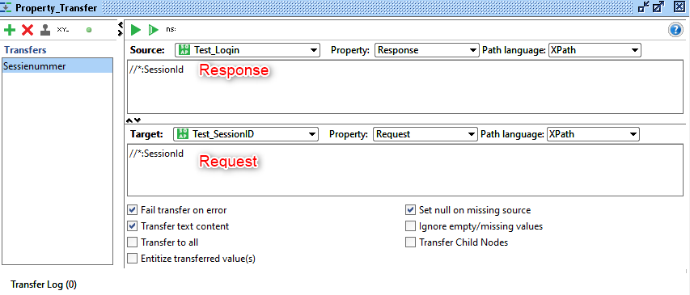
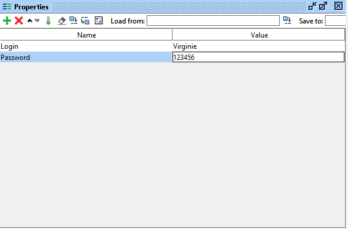

This article describes how to test a series of Web Services with data that is transferred between them.

For example – we have a service that we want to call - but before it, we need to call another service to login and receive a session ID.  
We need to define:

1.	The call to the first service [Test_Login]

*Request* 
```xml
<bon:Test_Login>
    <bon:piUserId>Virginie</bon:piUserId>
    <bon:piPassword>123456</bon:piPassword>
</bon:Test_Login>
```
*Response*  
```xml
<wn0:Test_LoginResponse>
    <wn0:response >
        <wn0:SessionId>922486967</wn0:SessionId>
    </wn0:response>
</wn0:Test_LoginResponse>
```

2.	Extract the session ID from the response and inject it to the next service request. You need to use test steps calls "Property Transfer".  
Into the area text of the source, you put the name of the response element (in our example, it will be "SessionId").  
And on the second area text, you put the name of the request element ("SessionId" too).  



3.	Run the next service request.  

>When SOAP run , it will transfer the response element that we defined (*property transfer*) into the request element of the second service


## SoapUI with properties

To make it easier we’ll set some properties that we can share and reuse throughout our test case.

1.	Define a test case [Test_Login]
```xml
<bon:Test_Login>
    <bon:piUserId>Virginie</bon:piUserId>
    <bon:piPassword>123456</bon:piPassword>
</bon:Test_Login>
```
2.	Define the properties : login and password  

3. Use the properties into the request `${Properties_title#properties_name}`
```xml
<bon:Test_Login>
    <bon:piUserId>${Properties#Login}</bon:piUserId>
    <bon:piPassword>${Properties#Password}</bon:piPassword>
</bon:Test_Login>
```

>When SOAP step is executed, SoapUI will replace this string with the values of the "Login" and "Password" property of the "Properties" step (in the example, it will be "Virginie" and "123456").

