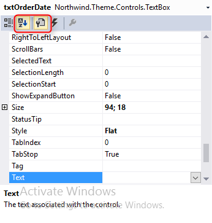

# Properties
1.	We used some control properties like the read-only property of a textbox.
Every control exposes several properties that can be set, similar to Magic.
2.	In "ShowOrders", open the screen designer and review the list of properties for the "OrderDate" textbox control.
3.	Notice that the list can be ordered in alphabetical order (useful if you know what you’re looking for) or by Category.

4.	Under the **Appearance** category, look at the **BackColor** and **ForColor** properties. Note that unlike Magic, their values can be set without any need for an external file. 
5.	Set the **BackColor** of the "OrderDate" textbox to be _Yellow_ and the **ForeColor** to be _Red_.
6.	Build and run. 
7.	Change the grid **ActiveRowStyle** property to be Border.
8.	Change the following properties of the grid control:
    a.	**RowColorStyle** to AlternatingRowBackColor
    b.	**AlternatingBackcolor** to LightBlue.
9.	Build and run the program.
10. Notice that if you use the AlternatingRowBackColor property, it will overwrite any BackColor that you already have in the grid. This is the reason why we had to build our example first in #5.
11. Note that sometimes we want to use an expression for the control properties which will set the property value according to certain condition. We will see how to do this shortly.
12. Exercise: Control’s Properties

