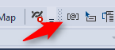
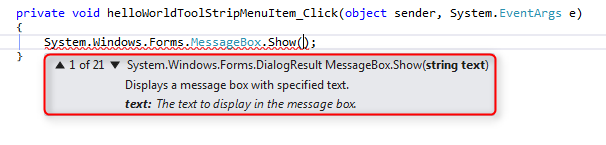

### Method Arguments and Overloading
Method arguments are sent between curly brackets.
To see the arguments, type open parenthesis - or click the method parameter button on the toolbox when the cursor is between the parenthesis:



Or press **CTRL-SHIFT-SPACE** between the parentheses.


Overloading allows Methods to have the same name but with different parameters.

 
Method can have several options based on the number or type of parameters it receives. – Check the 2rd option (string text, string caption)
Similar to Magic Verify option that has several options.
Will display the available variation of the Show method and the required parameter info. (Displayed in Bold), we can add caption and button 

```diff
namespace Northwind.Training
{
    Class HelloWorld
    {
       public void Run()
       {
-           System.Windows.Forms.MessageBox.Show("Hello World");
+           System.Windows.Forms.MessageBox.Show("Hello World", "Hello World Caption", System.Windows.Forms.MessageBoxButton.OK);
       }     
    }
}
```

 <iframe width="560" height="315" src="https://www.youtube.com/embed/Z97ayKhfYtE" frameborder="0" allowfullscreen></iframe>
