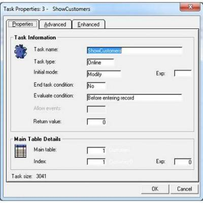

# Comparison with Magic's Task Properties Dialog Box

## Introduction
This article is one of a series of articles aimed at providing further orientation with the migrated code for Magic programmers. This time we will look at the 'Task Properties' screens as they appear in eDeveloper (version 9) and show the equivelant representation of each property in the migrated code. Many of the Magic properties have various options and we will also look at the different representations in the migrated code for each option.

There are three Properties tabs in eDeveloper, with the following tags: Properties, Advanced and Enhanced. Let's look at each Tab separately.

## Properties Tab
A screen shot of eDeveloper's Properties tab appears below:



The following sections explain the equivalent of these properties in the migrated code.

---

### Task Name

Name in Migrated Code: **Title**  
Location in Migrated Code: **Constructor**  

#### Notes

The original task name is migrated to a Class Name.In the migrated code, the task name is preserved for backward compatibility reasons in the Title Property (such as supporting the 'prog' function).

#### Example
```csdiff
  public ShowOrders()
        {   //... other code
            Title = "ShowOrders";
            // other code
        }
```
#### See Also
* [UIController Title property](http://www.fireflymigration.com/reference/html/P_Firefly_Box_UIController_Title.htm)  
* [BusinessProcess Title property](http://www.fireflymigration.com/reference/html/P_Firefly_Box_BusinessProcess_Title.htm)

---

### Task Type

The Task Type in Magic is either Online or Batch. In the migrated code, online tasks convert to classes which inherit from the UIController Class, while Batch tasks convert to classes which inherit from the BusinessProcess class.

Name in Migrated Code: **UIController, BusinessProcess**  
Location in Migrated Code: **Class**  
Example: UIController
```csdiff
internal class Orders1 :UIControllerBase 
{
}
```
Example: BusinessProcess
```csdiff
internal class Print_Order : BusinessProcessBase 
{
}
```
 
Note: A further class called the **FlowUIController** class is used for Magic Code from Online tasks that have code in the Record Main.  
For such code, The migrated code will inherit from the FlowUIController class:

For example:
```csdiff
 internal class Orders1 : FlowUIControllerBase 
 {
 }
 ```
 #### See Also
* [UIController Class](http://fireflymigration.com/reference/html/T_Firefly_Box_UIController.htm)  
* [BusinessProcess Class](http://fireflymigration.com/reference/html/T_Firefly_Box_BusinessProcess.htm)  
* [UIController Class members](http://www.fireflymigration.com/reference/html/AllMembers_T_Firefly_Box_UIController.htm)   
* [BusinessProcess Class members](http://www.fireflymigration.com/reference/html/AllMembers_T_Firefly_Box_BusinessProcess.htm)   

---

### Initial Mode

Name in Migrated Code: **Activity**  
Location in Migrated Code: **OnLoad Method**
Values:

| Magic Name 	| Migrated Code Name      	|
|------------	|-------------------------	|
| Query      	| Browse                  	|
| Modify     	| Update                  	|
| Create     	| Insert                  	|
| Delete     	| Delete                  	|
| As Parent  	| u.ActivityOfParent      	|
| By Exp     	| u.TranslateTaskActivity 	|

Examples:  
Browse:  
```Activity = Activities.Browse;```  
By Parent:
```csdiff
  public ShowOrders()
  {   //... other code
       Activity = u.ActivityOfParent;
       // other code
  }
```
By Expression:  
```csdiff
  public ShowOrders()
  {   //... other code
      Activity =  u.TranslateTaskActivity(u.if(1==1,"Q","M")); 
      // other code
  }
```
#### See Also
* [UIController Activity Property](http://fireflymigration.com/reference/html/P_Firefly_Box_UIController_Activity.htm)  
* [BusinessProcess Activity Property](http://fireflymigration.com/reference/html/P_Firefly_Box_BusinessProcess_Activity.htm)  
* [Activities Enum](http://fireflymigration.com/reference/html/T_Firefly_Box_Activities.htm)   

---

### End Task / Condition for End Task

Name in Migrated Code: **Exit**  
Location in Migrated Class: **OnLoad Method**   
Values:

| Magic Name                            	| Migrated Code Name 	|
|---------------------------------------	|--------------------	|
| Before Entering Record                	| BeforeRow          	|
| After Updating Record                 	| AfterRow           	|
| Immediately when condition is Changed 	| AsSoonAsPossible   	|

Examples:  
Exit:  
```Exit();```

Exit Before Row:  
```Exit(ExitTiming.BeforeRow, () = > u.EOF(0, 1));```  

Exit After Row  
```Exit(ExitTiming.AfterRow, () = > Counter == 10);```

Note: As stated, the 'Immediately when condition is changed' option, translates in the migrated code to ExitTiming.AsSoonAsPossible. In this scenario, Magic evaluates the end condition after each operation in the code. To support this behavior, migrated code with this option will place the EvaluateExitCondition() Method between each line of code. Example:
```csdiff
protected override void OnLoad()
{
   Exit(ExitTiming.AsSoonAsPossible,() => numerator==1);
}
 
protected override void OnLeaveRow()
{
    EvaluateExitCondition();
    numerator.Value = 1;
    EvaluateExitCondition();
    Warning("Message to User");
    EvaluateExitCondition();
    numerator.Value = 2;
}
```
In the above example, the task will end as soon as numerator's value is equal to 1. Even though at the end of the OnLeaveRow method, numerator's value is set to 2, the EvaluateExitCondition method is already called in the second row of code, the condition evaluates to true and the OnLeaveRow method ends there, without ever reaching numerator being set to 2.

#### See Also
* [UIController Exit Method + examples](http://www.fireflymigration.com/reference/html/M_Firefly_Box_UIController_Exit.htm)  
* [BusinessProcess Exit Method + examples](http://fireflymigration.com/reference/html/M_Firefly_Box_BusinessProcess_Exit.htm)  
* [Exit Method Overloads](http://www.fireflymigration.com/reference/html/Overload_Firefly_Box_BusinessProcess_Exit.htm)   

---

### Allow Events

Name in Migrated Code: **AllowUserAbort**  
Location in Migrated Code: **OnLoad Method** 
Examples:

```AllowUserAbort = true;```
With Expression:

```AllowUserAbort = Customers.CustomerID == "1";```

Note: This property allows the user to abort a Business process task by pressing Esc, or by clicking on a parent form. See Also:

#### See Also
* [BusinessProcess AllowUserAbort Property + example](http://fireflymigration.com/reference/html/P_Firefly_Box_BusinessProcess_AllowUserAbort.htm)  

---


### Return Value

Name in Migrated Code: **return _taskresult;**  
Location in Migrated Code: **Run Method** 
Example:
```csdiff
class batchToCalculateSum : BusinessProcessBase 
{
   readonly NumberColumn var1 = new NumberColumn();
   readonly NumberColumn var2 = new NumberColumn();
   Number _taskResult;
   public batchToCalculateSum()
   {
     Columns.Add(var1);
     Columns.Add(var2);
 
     public Number Run(NumberParameter pvar1, NumberParameter pvar2)
     {
            BindParameter(var1, pvar1);
            BindParameter(var2, pvar2);
            Execute();
            return _taskResult;
      }
      protected override void OnEnd()
      {
            _taskResult = var1 + var2;
      }
   }
 }
```
The migrated code will calculate the return expression in the onEnd method and will set it to a member called _taskResult, which will be used as the return value of the Run method.

---

### Main Table

Name in Migrated Code: **From**
Location in Migrated Class: **InitializeDataView Method**
Example:
```csdiff
class ShowCustomers
{
	internal readonly Model.Customers Customers = new Model.Customers();
	//other code
	void InitializeDataView()
        {
             From = Customers;
            // other code
        }
}
``` 

#### See Also:
* [UIController From](http://www.fireflymigration.com/reference/html/P_Firefly_Box_UIController_From.htm) 
* [BusinessProcess From](http://fireflymigration.com/reference/html/P_Firefly_Box_BusinessProcess_From.htm) 
 
 ---      
 
### Index
 
 
Name in Migrated Code : **OrderBy**
Location in Migrated Code : **InitializeDataView Method**
Examples:
```csdiff
void InitializeDataView()
{
        From = Customers;
        OrderBy = Customers.SortByCustomerID;
}  
```

#### See Also :
* [UIController OrderBy](http://www.fireflymigration.com/reference/html/P_Firefly_Box_UIController_OrderBy.htm) 
* [BusinessProcess OrderBy](http://www.fireflymigration.com/reference/html/P_Firefly_Box_BusinessProcess_OrderBy.htm) 

---

### Index Expression
 
Name in Migrated Code : **OrderBy**
Location in Migrated Code : **OnLoad Method** 
Note :  If an index expression was used the migrated code will have the OrderBy statement in the OnLoad Method as opposed to the InitializeDataView Method.
Example : In the following example, the index expression was set to: "if (a=1, '1'Key, '2'Key)".
```csdiff
protected override void OnLoad()
{
    // other code
    OrderBy = Customers.Indexes[u.If(v_Indicator == 1, Category.Indexes.IndexOf(Category.SortByCategoryID), Category.Indexes.IndexOf(Category.SortByCategoryName))];
    } 
``` 

#### See Also :
* [UIController OrderBy](http://www.fireflymigration.com/reference/html/P_Firefly_Box_UIController_OrderBy.htm) 
* [BusinessProcess OrderBy](http://www.fireflymigration.com/reference/html/P_Firefly_Box_BusinessProcess_OrderBy.htm) 

--- 

## Advanced Tab
A screen shot of eDeveloper's Advanced Properties tab appears below:

 

The following notes explain the equivalent to these properties in the migrated code.

### Selection Table

Name in Migrated Code: **AllowSelect**
Location in Migrated Code: **OnLoad Method**
Example:
```csdiff
      protected override void OnLoad()
        {
            // other code
            AllowSelect = true;
            // other code
        }
```
#### See Also :
* [AllowSelect](http://fireflymigration.com/reference/html/P_Firefly_Box_UIController_AllowSelect.htm) 

---

### Resident Task

Name in Migrated Code: **KeepChildRelationCacheAlive** 
Location in Migrated Code: **OnLoad Method** 
Notes: This option allows the cache for relations to be stored even when exiting the class. Use this option for scenarios where it is very likely or definite that the class will execute again, requiring the relation cache from before to continue to be available.
The option is used together with CachedUIController and or Lazy. It is meant solely for the purposes of backward compatibility and should not be used when writing new code. 
Example:
``` KeepChildRelationCacheAlive = true;``` 

---

### Main Display

This Option determines which screen to display based on a numeric value obtained by an expression.

Name in Migrated Code: **See example**
Location in Migrated Code: **OnLoad Method**
Example:
```csdiff
protected override void OnLoad() {

   // other code
   switch ((int)(u.If(vEnglish, 2, 1)))
   {
       case 1:
            View = new UI.OtherLang_UI(this);
            SetMainDisplayIndex(1);
            break;
        case 2:
            View = new UI.English(this);
            SetMainDisplayIndex(2);
            break;
    }
}
```
---

## Enhanced Tab

 

The following notes explain the equivalent to these properties in the migrated code.

### Transaction Begin

Name in Migrated Code: **Transaction Scope**
Location in Migrated Code: **OnLoad Method**
Values:
**^Magic Name ^Migrated Code Name |**


| Before Task Prefix   	| Task           	|
|----------------------	|----------------	|
| OnRecordLock         	| RowLocking     	|
| BeforeRecordPrefix   	| Row            	|
| BeforeRecordSuffix   	| LeaveRow       	|
| Before Record Update 	| SaveToDataBase 	|
| None                 	| None           	|
| Group                	| Group          	|

Note: The Group option is only applicable for BusinessProcess.
Example:
``` TransactionScope = TransactionScopes.RowLocking;```

#### See Also :
* [UIController TransactionScope Property](http://www.fireflymigration.com/reference/html/P_Firefly_Box_UIController_TransactionScope.htm) 
* [BusinessProcess TransactionScope Property](http://www.fireflymigration.com/reference/html/P_Firefly_Box_BusinessProcess_TransactionScope.htm) 
* [TransactionScope Enum](http://fireflymigration.com/reference/html/T_Firefly_Box_TransactionScopes.htm) 

---

### Locking Strategy

Name in Migrated Code: **Rowlocking**
Location in Migrated Code: **OnLoad Method**
Values:
**^Magic Name ^Migrated Code Name |**

| No Lock       	| None         	|
|---------------	|--------------	|
| Immediate     	| OnRowLoading 	|
| Before Update 	| OnRowSaving  	|
| On Modify     	| OnUserEdit   	|

Example: OnRowSaving:
``` RowLocking = LockingStrategy.OnRowSaving;```

#### See Also :
* [UIController LockingStrategy Property](http://www.fireflymigration.com/reference/html/P_Firefly_Box_UIController_RowLocking.htm) 
* [BusinessProcess LockingStrategy Property](http://www.fireflymigration.com/reference/html/P_Firefly_Box_BusinessProcess_RowLocking.htm) 
* [LockingStrategy Enum](http://www.fireflymigration.com/reference/html/T_Firefly_Box_LockingStrategy.htm) 

Note: If the Locking Strategy is “On Modify” in Magic (LockingSTrategy.OnUserEdit) then it may be necessary when calling a task or program to specify that the current record with all its links must be locked. This may be specified in Magic by clicking ctrl+P on the call task or call program line, and specifying the lock as 'Yes' in the dialog that appears. To support this functionality, the LockCurrentRow method is employed. As an example:
```csdiff
if(V_counter == 1) {

 LockCurrentRow();
 new ProgramName(this).Run();
}
```

#### See Also :
* [UIController LockCurrentRow Method](http://www.fireflymigration.com/reference/html/M_Firefly_Box_UIController_LockCurrentRow.htm) 
* [BusinessProcess LockCurrentRow Method](http://www.fireflymigration.com/reference/html/M_Firefly_Box_BusinessProcess_LockCurrentRow.htm) 

---

### Cache Strategy

Location in migrated code *: The Cached property of the Entity defined in the From property of the task.
Example:
```csdiff 
readonly Model.Categories _categories = new Model.Categories {

 Cached = true
};
```


### Error Behavior Strategy

Name in Migrated Code: **OnDatabaseErrorRetry**
Location in Migrated Code: **OnLoad Method**
Example: Error behaviour strategy = abort
``` OnDatabaseErrorRetry = false;```

Example: Error behaviour strategy = recover
```OnDatabaseErrorRetry = true;```

#### See Also :
* [UIController OnDatabaseError Property](http://www.fireflymigration.com/reference/html/P_Firefly_Box_UIController_OnDatabaseErrorRetry.htm) 
* [BusinessProcess OnDatabaseError Property](http://www.fireflymigration.com/reference/html/P_Firefly_Box_BusinessProcess_OnDatabaseErrorRetry.htm) 

---
