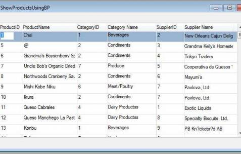
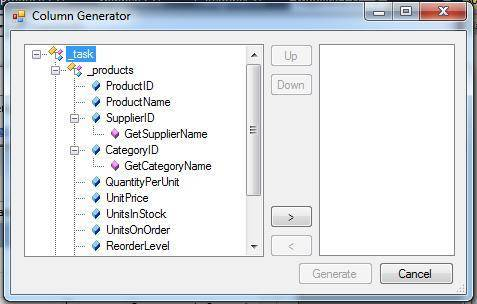

# THIS ARTICLE IS STILL UNDER CONSTRUCTION

## Building a Generic Method

### Introduction

In the previous article, based on Tables from the Northwind Database, we discussed how to improvise our code to obtain a Category Name for different Classes such as ShowProducts and ShowPrices, without having to use a relation each time. We showed how we can build a Method either in the Entity Class or even better, in the Type Class, if one exists. We then can directly reference this Method from any Class that we wish.

### Get Supplier Name

Let's build a similar BusinessProcess to get the Supplier Name, based on the SupplierID, as follows.
```csharp
class GetSupplierName : BusinessProcessBase
{
    internal readonly Model.Suppliers _suppliers = new Model.Suppliers();
    TextColumn _result;
 
    public GetSupplierName()
    {
        From = _suppliers;            
    }
 
    public Text Run(Number pSupplierID)
    {
        Where.Add(_suppliers.SupplierID.IsEqualTo(pSupplierID));
        Execute();
        return _result;
    }
 
    protected override void OnLeaveRow()
    {
        _result = _suppliers.CompanyName;
    }
}
```
Now, let's define a Type called Supplier ID and add a Method to it that gets the Supplier Name:
```csharp
class SupplierID : NumberColumn
{
    public SupplierID()
        : base("SupplierID", "N10")
    {
    }
 
    public Text GetSupplierName()
    {
        return new DevDemo.GetSupplierName().Run(this);
    }
}
```
Having defined the Type, let's redefine the SupplierID column in the Supplier Entity to be of type SupplierID:
```csharp
/// <summary>SupplierID</summary>
public readonly Types.SupplierID SupplierID = new Types.SupplierID();
```
Now, as we did with GetCategoryName, let's create a virtual column called _supplierName and use BindValue to attach its value to the return value from GetSupplierName, as follows:
```csharp
class ShowProductsUsingBP : UIControllerBase
{
    internal readonly Model.Products _products = new Model.Products();
 
    internal readonly TextColumn _categoryName = new TextColumn();
    internal readonly TextColumn _supplierName = new TextColumn(); 
 
    public ShowProductsUsingBP()
    {
        From = _products;
 
        _categoryName.BindValue(() => _products.CategoryID.GetCategoryName());
        _supplierName.BindValue(()=> _products.SupplierID.GetSupplierName());
 
        View = new UI.ShowProductsUsingBPUI(this);
    }
 
    public void Run()
    {
        Execute();
    }
}
```

- Display the Supplier Name on the Screen by selecting the Virtual _supplierName Column.  


- As mentioned in the previous article, the GetSupplierName method is available from the SupplierID column as shown below:  


### Refactoring the code

Looking at the code above, we note that we have two very similar Business Process Classes: GetCategoryName and GetSupplierName. Their methodology is exactly the same; they both accept an ID as a parameter and return a Text field containing the corresponding name. In addtion, they both lead to creating a Method on the Type Class of the ID Column that in turn, calls the Method to obtain the Name required.

Let's now combine the above two Methods into a Generic Method that can potentially accept a Number ID from any Table and return its corresponding Name. This will then allow us to maintain one Generic Business Class instead of a Business Class for every ID/Name pair.

### A Generic Method

To accomplish this task, let's build a Generic Business Process Class called GetNameFrom NumberID, that will accept in its Constructor, three parameters:

- Entity - Table Name
- ID - NumberColumn
- Name - TextColumn

The code appears as follows:
```csharp
class GetNameFromNumberID : BusinessProcessBase
{
    Text _result;
    TextColumn _name;
    NumberColumn _id;
       
    public GetNameFromNumberID(Entity myTable,NumberColumn numberColumnID,TextColumn resultNameColumn)
    {
        From = myTable;
        _name = resultNameColumn;
        _id = numberColumnID;
    }
        
    public Text Run(Number pNumberID)
    {
        Where.Add(_id.IsEqualTo(pNumberID));
        Execute();
        return _result; 
    }

    protected override void OnEnterRow()
    {
        _result = _name;
    }
}
```
This we have a generic Method which can receive a Numeric ID and return a Text Name.

The next stage is to call this Method from the Type Class.

This can be achieved with a code change to the Method in the Type class, as follows:

- Create a new Supplier Entity and pass it as the first parameter.
- Pass the SupplierID and the Supplier Name as parameters 2 and 3, to be displayed on the screen.

The code appears below:
```csharp
class SupplierID : NumberColumn
{
    public SupplierID()
        : base("SupplierID", "N10")
    {
    }
        
    public Text GetSupplierName()
    {
        var s = new Model.Suppliers();
        return new DevDemo.GetNameFromNumberID(s, s.SupplierID, s.CompanyName).Run(this);
    }
}
```
Having reached this stage, we can now eliminate the 2 Business Processes GetCategoryName and GetSupplierName