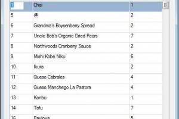
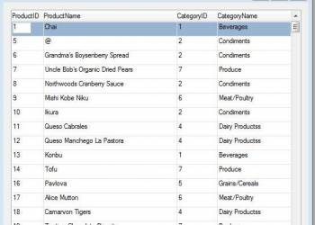

# THIS ARTICLE IS STILL UNDER CONSTRUCTION

## Obtaining Category Name from CategoryID

For the purposes of this article, we will refer to the Northwind database.

### Using a Relation

First, lets build a simple UIController grid which shows some columns from the Products Table. The code appears below:
```csharp
using System; 
using System.Collections.Generic; 
using System.Text; 
using Firefly.Box; 
using ENV.Data;   

namespace Northwind.DevDemo 
{     
    class ShowProducts : UIControllerBase     
    {   
       internal readonly Model.Products _products = new Model.Products();           
       public ShowProducts()         
       {             
          From = _products;
          View = new UI.ShowProductsUI(this);
        }           
        
        public void Run()
        {             
           Execute(); 
        }
     }
}    
```

The screen looks like this:



The next step is to display the Category Name in the next column. One way of doing this is to add a relation to our code as follows:
```csharp
using System;
using System.Collections.Generic;
using System.Text;
using Firefly.Box;
using ENV.Data;
 
namespace Northwind.DevDemo
{
    class ShowProducts : UIControllerBase
    {
        internal readonly Model.Products _products = new Model.Products();
        internal readonly Model.Categories _categories = new Model.Categories();
 
        public ShowProducts()
        {
            From = _products;
 
            Relations.Add(_categories,RelationType.Find,
                _categories.CategoryID.IsEqualTo(_products.CategoryID),
                _categories.SortByCategoryID);
 
             View = new UI.ShowProductsUI(this);
        }
 
        public void Run()
        {
            Execute();
        }
    }
} 
```

We can now add the Category Name column to the screen as follows:



Now lets suppose that we want to write another program that will show data from the Prices table.This table includes the CategoryID column as well. Here is the code for this program:
```csharp
namespace Northwind.DevDemo 
{     
    class ShowPrices : UIControllerBase
    {          
        internal readonly Model.Prices _prices = new Model.Prices();

        public ShowPrices()   
        {     
        From = _prices; 
        View = new UI.ShowPricesUI(this);
        } 

        public void Run()      
        {    
            Execute();    
        } 
    }
}
```
The screen looks as follows:


Now lets add the CategoryName Column which will require once again, using a relation, as follows:
```csharp
class ShowPrices : UIControllerBase
    {
 
        internal readonly Model.Prices _prices = new Model.Prices();
        internal readonly Model.Categories _categories = new Model.Categories();
 
        public ShowPrices()
        {
            From = _prices;
            Relations.Add(_categories, _categories.CategoryID.IsEqualTo(_prices.CategoryID));
 
 
            View = new UI.ShowPricesUI(this);
        }
        public void Run()
        {
            Execute();
        }
    }
} 
```

Add the CategoryName to the screen which will now look like this:

showpriceswithcategoryidandcategoryname.jpg
Obviously, the need to create a relation to the Categories table each time proves to be repetitive.

### Using a BusinessProcess

Let's introduce the following BusinessProcess Class called GetCategoryName, which returns the Category Name based on a CategoryID parameter, as follows:
```csharp
namespace Northwind.DevDemo
{
    class GetCategoryName : BusinessProcessBase
    {
        internal readonly Model.Categories _categories = new Model.Categories();
        Text _result;
 
        public GetCategoryName()
        {
            From = _categories;
        }
 
        protected override void OnLeaveRow()
        {
            _result =_categories.CategoryName;
        }
 
        public Text Run(NumberColumn pCategoryID)
        {
            Where.Add(_categories.CategoryID.IsEqualTo(pCategoryID));
            Execute();
            return _result;
        }
    }
}
```
We can now use this utility in both our Classes above, ShowProducts and ShowPrices, by introducing a virtual column in both Classes and binding its value to the result of the Run method in the GetCategoryName Class.

The adjustment will look like this, first in ShowPrices:
```csharp
namespace Northwind.DevDemo
{
    class ShowPricesUsingBP : UIControllerBase
    {
        internal readonly Model.Prices _prices = new Model.Prices();
        internal readonly TextColumn _categoryName = new TextColumn(); 
 
         public ShowPricesUsingBP()
        {
            _categoryName.BindValue(()=>new Northwind.DevDemo.GetCategoryName().Run(_prices.CategoryID));
            View = new UI.ShowPricesUsingBPUI(this);
        }
 
         public void Run()
        {
            Execute();
        }
    }
}
```
and also in ShowProducts:

```csharp
namespace Northwind.DevDemo
{
    class ShowPricesUsingBP : UIControllerBase
    {
        internal readonly Model.Prices _prices = new Model.Prices();
        internal readonly TextColumn _categoryName = new TextColumn(); 
 
         public ShowPricesUsingBP()
        {
            From = _prices;
            _categoryName.BindValue(()=>new Northwind.DevDemo.GetCategoryName().Run(_prices.CategoryID));
 
             View = new UI.ShowPricesUsingBPUI(this);
        }
 
        public void Run()
        {
            Execute();
        }
    }
}
```

In both classes, there is no longer a need to use the Categories realtion in order to obtain the Ctegory Name.

### Method in the Entity

We can add a Method to each Entity with a CategoryID column to obtain the Category Name. The way to do this is to add a Method in each Entity Class, which returns the Category Name, based on the current CategoryID, as follows:

For the Products and Prices Entities, we ad the following:
```csharp
public Text GetCategoryName()
{
    return new DevDemo.GetCategoryName().Run(this.CategoryID);
}
```
In the ShowPrices Class code, we can now simplify the bindvalue statement as follows:
```csharp
namespace Northwind.DevDemo
{
    class ShowPricesUsingBP : UIControllerBase
    {
        internal readonly Model.Prices _prices = new Model.Prices();
        internal readonly TextColumn _categoryName = new TextColumn(); 
 
        public ShowPricesUsingBP()
        {
            From = _prices;
 //           _categoryName.BindValue(()=>new Northwind.DevDemo.GetCategoryName().Run(_prices.CategoryID));
              _categoryName.BindValue(() => _prices.GetCategoryName());
 
            View = new UI.ShowPricesUsingBPUI(this);
        }
 
        public void Run()
        {
            Execute();
        }
    }
}
```
Note the new BindValue syntax as opposed to the previous one, which is now commented out.

The same applies for the ShowProducts Class code:
```csharp
namespace Northwind.DevDemo
{
    class ShowProductsUsingBP : UIControllerBase
    {
        internal readonly Model.Products _products = new Model.Products();
        internal readonly TextColumn _categoryName = new TextColumn(); 
 
        public ShowProductsUsingBP()
        {
            From = _products;
            //_categoryName.BindValue(() => new Northwind.DevDemo.GetCategoryName().Run(_products.CategoryID));
            _categoryName.BindValue(() => _products.GetCategoryName());
 
            View = new UI.ShowProductsUsingBPUI(this);
        }
 
        public void Run()
        {
            Execute();
        }
    }
}
```
Another advantage of using a Method in this way is that when generating tables, the GetCategoryName Method is available together with the list of Field Columns as shown in the following picture below:


This can be useful, should you wish to directly bind a field using the Column Generator, to the Method. Note however, that in such a case, the field will not be sortable.

### Method on the Type

The CategoryID field is defined as follows in the Products Entity:
```csharp
/// <summary>CategoryID</summary>
public readonly NumberColumn CategoryID = new NumberColumn("CategoryID", "N10", "CategoryID");
```
You can define a specific Type for the CategoryID as Follows:
```csharp
namespace Northwind.Types
{
    class CategoryID : NumberColumn
    {
        public CategoryID()
            : base("CategoryID", "N10")
        {
        }
    }
}
```
Now you redefine the CategoryID Numbercolumn in the Prices Entity Class to be defined based on the CategoryID Field's Type, as follows:
```csharp
public readonly Types.CategoryID CategoryID = new Types.CategoryID();
```
The same type of change is made in Products, firstly with the CategoryID Column Definition:
```csharp
//public readonly NumberColumn CategoryID = new NumberColumn("CategoryID", "N10", "CategoryID");
  public readonly Types.CategoryID CategoryID = new Types.CategoryID();
```
Secondly, The ShowProducts' Constructor now changes its BindValue for the Virtual Column as follows:
```csharp
        public ShowPricesUsingBP()
        {
            From = _prices;
 
             //   _categoryName.BindValue(()=>new Northwind.DevDemo.GetCategoryName().Run(_prices.CategoryID));
            _categoryName.BindValue(() => _prices.CategoryID.GetCategoryName());
 
            View = new UI.ShowPricesUsingBPUI(this);
        }
 ```
Note also that when using the Column Wizard to build tables, the GetCategoryName Method will now be available as a method attached to CategoryID, as shown below:

